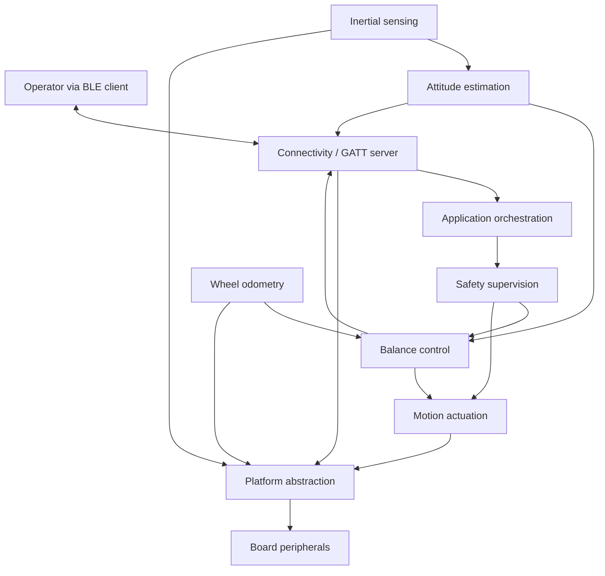
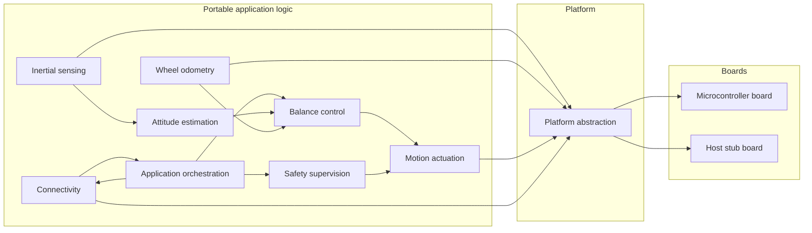

| Field     | Value               |
|-----------|---------------------|
| Title     | System Architecture |
| Type      | architecture        |
| Status    | draft               |
| Version   | 0.2.0               |
| Component | system              |
| Date      | 2026-09-16          |

> Architecture of a two-wheeled self-balancing inverted pendulum robot. This document
> describes *what* the system is composed of and *why*; component-level behaviour is in
> `documentation/design/`, and the mathematics is in `documentation/theory/`.

---

## Assumptions & Constraints

- **Assumption**: the robot is a two-wheeled balancer — the body is the pendulum and the
  two coaxial driven wheels are the cart. The controlled degree of freedom is body pitch;
  forward velocity and yaw rate are the commanded outputs.
- **Assumption**: the robot operates on a flat, rigid, reasonably high-friction surface.
  Slopes, steps and slipping wheels are out of scope for this revision.
- **Assumption**: the operator is present and in Bluetooth range. There is no autonomy
  and no obstacle sensing.
- **Constraint**: swing-up and self-recovery are out of scope. The robot is placed
  upright by hand and armed; a fall ends the balancing session.
- **Constraint**: no dynamic memory allocation in runtime code; all collections are
  bounded at compile time.
- **Constraint**: application logic depends only on the platform abstraction, never on a
  concrete microcontroller, so that it is unit-testable on the host.
- **Constraint**: the control law is **not fixed by the architecture**. Multiple control
  strategies are interchangeable behind one interface and selectable at runtime, so no
  architectural element may presume a particular law.
- **Constraint**: the sole external interface is a Bluetooth Low Energy GATT server.
  There is no wired operator interface in the product configuration.
- **Constraint**: the balance loop runs at 500 Hz with an end-to-end sensor-to-actuator
  latency budget of 3 ms.

---

## System Overview

The robot is an unstable plant that must be actively stabilised. Sensing produces a body
attitude estimate and wheel motion; a control strategy converts that state plus the
operator's setpoints into per-wheel effort; actuation applies it. A safety supervisor sits
above all of it and owns the single decision that matters — whether the motors may be
energised at all.

Two seams give the system its shape. The **platform abstraction** separates portable logic
from any particular board, so the whole control stack builds and runs on the host. The
**controller strategy interface** separates the balancing policy from everything that
feeds it, so the control law is a runtime choice rather than an architectural commitment.



---

## Component Decomposition

| Sub-component             | Responsibility                                                                                                              |
|---------------------------|-----------------------------------------------------------------------------------------------------------------------------|
| Inertial sensing          | Acquire calibrated angular rate and acceleration in the body frame; signal staleness and transfer failure                   |
| Wheel odometry            | Accumulate the decoded encoder counts into signed wheel position and velocity; derive chassis forward velocity and yaw rate |
| Attitude estimation       | Fuse inertial measurements into body pitch and pitch rate with an explicit validity indication                              |
| Balance control           | Host the interchangeable control strategies; turn estimated state and setpoints into per-wheel effort                       |
| Motion actuation          | Configure the motor driver, map effort onto bridge duty and direction, surface driver faults                                |
| Safety supervision        | Own the operating mode; arm, disarm, detect faults, latch them, and force the drive to a safe state                         |
| Connectivity              | Present the GATT server: teleoperation, telemetry, tuning and mode control                                                  |
| Application orchestration | Compose the components, schedule the control loops, route setpoints and telemetry                                           |
| Platform abstraction      | Declare the peripheral roles the application needs; realised per board and mocked for tests                                 |



---

## Interfaces & Contracts

### Provided Interfaces

| Interface                     | Direction | Purpose                                                                       | Invariants                                                                                                                  |
|-------------------------------|-----------|-------------------------------------------------------------------------------|-----------------------------------------------------------------------------------------------------------------------------|
| Robot control service (GATT)  | provided  | The sole external interface: motion commands, mode control, telemetry, tuning | Pairing required before any commanding write; one client at a time                                                          |
| Telemetry stream              | provided  | Notify the connected client of the robot state                                | Emitted only while subscribed; values within one update come from a single control iteration; never blocks the control loop |
| Tuning and strategy selection | provided  | Read and write the active strategy and its parameters                         | Accepted only while not ARMED; parameter set is self-describing so a client needs no built-in knowledge of the strategy     |
| Operating mode                | provided  | Report and command the mode                                                   | Exactly one mode is active; only defined transitions are accepted; faults latch until explicitly cleared                    |

### Required Interfaces

| Interface                                    | Direction | Purpose                                                          | Invariants                                                                                                           |
|----------------------------------------------|-----------|------------------------------------------------------------------|----------------------------------------------------------------------------------------------------------------------|
| Inertial measurement source                  | required  | Angular rate and acceleration in the body frame                  | Fixed axis convention independent of the part fitted; failure and staleness are reported, never silently substituted |
| Wheel encoder source                         | required  | Decoded incremental counts per wheel, and the counter resolution | Forward motion is positive on both wheels; index events are not yet provided — see REQ-ODOM-005                      |
| Motor bridge control                         | required  | Signed effort per motor, plus tri-state and brake disable states | The tri-state is always available; disable must not require a healthy control loop                                   |
| Motor driver configuration and fault channel | required  | Configure the driver and observe its fault output                | Configuration is verified by read-back; an asserted fault disables both bridges                                      |
| Bluetooth peripheral                         | required  | Advertising, connection lifecycle, pairing, GATT database        | Connection loss is observable to the application                                                                     |
| Non-volatile parameter store                 | required  | Persist the strategy selection and its parameters                | A failed or absent store degrades to built-in defaults rather than blocking startup                                  |
| Timebase                                     | required  | Drive the control loops and measure latency and jitter           | Monotonic; periods are met within the specified jitter bound                                                         |

---

## Data Flow

The arming, balancing and fault path — the sequence the whole architecture exists to serve.

```mermaid
sequenceDiagram
    participant Op as Operator (BLE client)
    participant Link as Connectivity
    participant Safety as Safety supervision
    participant Est as Attitude estimation
    participant Ctrl as Balance control
    participant Act as Motion actuation

    Op->>Link: Arm
    Link->>Safety: Arm request
    Safety->>Est: Query attitude and validity
    Est-->>Safety: Upright, valid
    Safety->>Ctrl: Reset strategy state, enable
    Safety-->>Link: Mode = ARMED

    loop Every balance period
        Est->>Ctrl: Pitch, pitch rate, validity
        Ctrl->>Act: Per-wheel effort
        Act-->>Safety: Driver health
        Ctrl-->>Link: Telemetry sample
    end

    Note over Est,Safety: Body tips beyond the fall threshold
    Est->>Safety: Pitch exceeds limit
    Safety->>Act: Tri-state both bridges
    Safety->>Ctrl: Disable
    Safety-->>Link: Mode = FAULT, cause latched
```

---

## Cross-Cutting Concerns

| Concern        | Policy / Approach                                                                                                                                                                               |
|----------------|-------------------------------------------------------------------------------------------------------------------------------------------------------------------------------------------------|
| Error handling | No exceptions in runtime code. Nullable results are optional values; failures are explicit error enumerations. Sensor failures propagate as an invalid estimate rather than a substituted value |
| Timing budget  | Balance loop 500 Hz, outer velocity and yaw loop 50 Hz, telemetry 25 Hz. Sensor-to-actuator latency at most 3 ms; loop start jitter within 10% of the period                                    |
| Memory         | No heap after startup; bounded containers only; worst-case stack depth determined at build time                                                                                                 |
| Safety         | The supervisor can always reach a safe state. Disabling the drive does not depend on the control loop being healthy; all safety-initiated disables tri-state rather than brake                  |
| Determinism    | No recursion and no unbounded iteration on the control path. Strategy selection is confined to a non-ARMED state so that the armed control path has fixed cost                                  |
| Testability    | Every component is written against the platform abstraction and exercised on the host with mocks; specification scenarios live in `documentation/use-cases/`                                    |
| Portability    | Boards differ only in their platform implementation; the host build is a first-class target                                                                                                     |

---

## Open Questions & Decisions

| # | Question / Decision                                                | Status  | Options Considered                                                  | Rationale                                                                                                                                                                                                                                                                         |
|---|--------------------------------------------------------------------|---------|---------------------------------------------------------------------|-----------------------------------------------------------------------------------------------------------------------------------------------------------------------------------------------------------------------------------------------------------------------------------|
| 1 | Which inertial sensor part                                         | decided | MPU6050; LSM303 + L3GD20; MPU9250                                   | An MPU9250, on SPI2 with its data-ready line interrupting. Chosen partly because a tested driver is already vendored. Its AK8963 magnetometer is deliberately unused. The deferral did its job — the estimator and controller were specified against the role and neither changes |
| 2 | Which control strategy ships as the default                        | open    | Cascaded PID; LQR                                                   | Decided *not* to settle architecturally. Both are implemented behind the strategy interface and selected at runtime, so this is a configuration default rather than a design commitment                                                                                           |
| 3 | Motor driver operating mode                                        | decided | Internal step sequencer; external commutation                       | One DRV8711 drives two brushed DC motors by bypassing its indexer and driving both full bridges directly — the part supplies two bridges, current regulation and fault reporting for one SPI configuration channel                                                                |
| 4 | Runtime strategy dispatch versus the no-virtual-dispatch rule      | decided | Compile-time selection; runtime interface                           | Runtime selection is required by the product. Dispatch is once per balance iteration in task context, never in an interrupt path, and the strategy cannot change while ARMED, so the armed cost is fixed                                                                          |
| 5 | Whether the estimator is a complementary filter or a Kalman filter | open    | Complementary; single-axis Kalman                                   | Both satisfy the estimation requirements; the trade is tuning effort against cycles. Deferred to implementation and recorded in the estimation design                                                                                                                             |
| 6 | Pairing and bonding policy                                         | open    | Just-works pairing; passkey                                         | Requirements demand pairing before any commanding write; the association model is a security decision still to be taken                                                                                                                                                           |
| 7 | Where specification scenarios execute                              | decided | `integration_tests/features/`; staged in `documentation/use-cases/` | Staged under `documentation/use-cases/` because the executable suite runs everything in `integration_tests/features/` and the components do not exist yet. Scenarios migrate per component as step definitions land                                                               |
