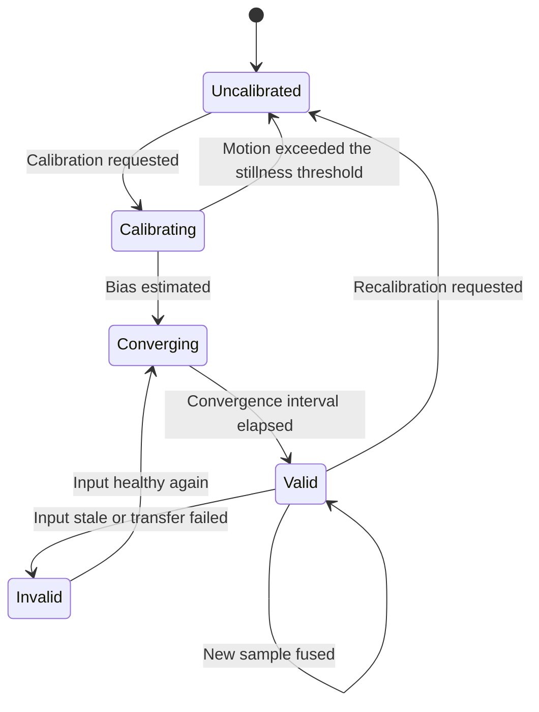
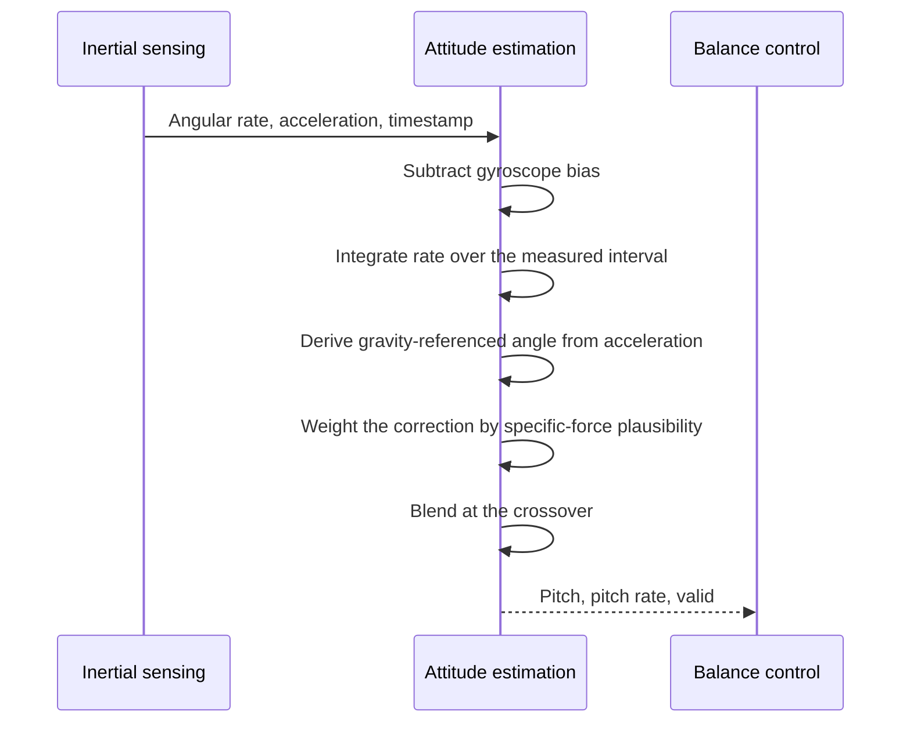
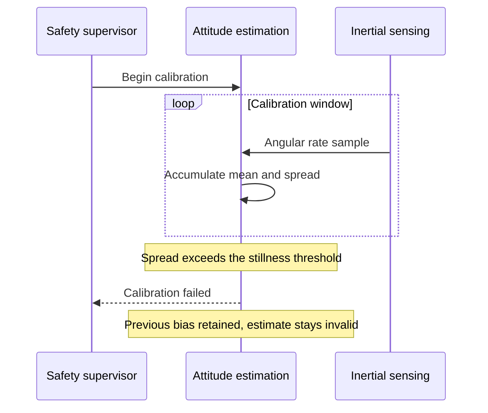
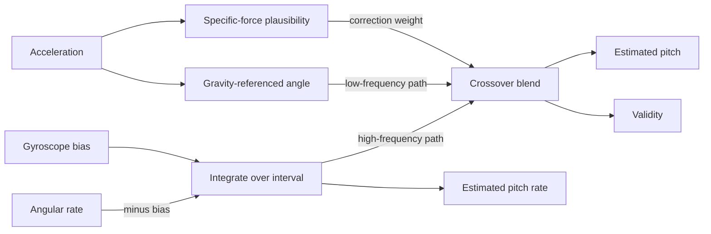

| Field     | Value                      |
|-----------|----------------------------|
| Title     | Attitude Estimation Design |
| Type      | design                     |
| Status    | draft                      |
| Version   | 0.2.0                      |
| Component | attitude-estimation        |
| Date      | 2026-09-24                 |

> The controller can only be as good as the pitch estimate. Neither sensor alone is
> usable: the gyroscope drifts, the accelerometer is fooled by the robot's own motion.

---

## Responsibilities

**Is responsible for:**
- Producing a body pitch angle and a pitch rate from inertial measurements.
- Publishing an explicit validity indication with every estimate.
- Limiting the influence of transient linear body acceleration on the pitch estimate.

**Is NOT responsible for:**
- Talking to the sensor part — it consumes calibrated measurements in a fixed body frame.
- Estimating or removing the gyroscope bias, and judging stillness for calibration. Those belong
  to inertial sensing, which publishes an already bias-corrected rate; see
  `documentation/design/imu-sensing.md`.
- Deciding what an invalid estimate means for the drive — the supervisor decides that.
- Estimating wheel motion or chassis velocity — that is wheel odometry.
- Choosing which sensor part is fitted; the design is deliberately part-agnostic.

---

## Component Details

### Part A — Why fusion is necessary

Integrating the gyroscope gives a clean, low-latency angle that drifts without bound as
the small bias error accumulates. The accelerometer measures the gravity direction, giving
an absolute reference that does not drift — but it measures *total* specific force, so any
acceleration of the chassis appears as a tilt. On a balancing robot this is the worst
possible coupling: leaning forward to accelerate produces an acceleration that looks like
more lean.

Fusion resolves this by trusting each sensor where it is strong: the gyroscope over short
intervals, the accelerometer over long ones. The crossover is the single most important
tuning decision in the component.

### Part B — Bias calibration

During CALIBRATING the robot is held still and the mean angular rate on each axis is
accumulated over a fixed window; that mean is the bias. The window must be long enough to
average sensor noise and short enough that the operator will actually hold still for it.

Stillness is verified, not assumed: if the measured motion during the window exceeds the
stillness threshold, the bias estimate would absorb real rotation and the component reports
failure rather than poisoning every subsequent estimate. Bias is re-estimated on every
power-on because it varies with temperature.

### Part C — Initial convergence

The fused estimate starts from the accelerometer-derived angle rather than from zero, so
that it begins close to the truth instead of converging towards it from an arbitrary
starting point. Until the filter has run for its convergence interval the estimate is
marked invalid, which is what prevents the supervisor from arming a robot whose estimate
happens to read upright by accident.

### Part D — Rejecting body acceleration

The accelerometer correction is attenuated when the measured specific force magnitude
departs from one gravity, which is the signature of the chassis accelerating rather than
merely tilting. During such an interval the estimate leans more heavily on the gyroscope,
accepting a little drift in exchange for not being pulled off by the robot's own motion.
This is what keeps a commanded acceleration from producing a sustained attitude error.

### Part E — Validity

Validity is a first-class output, not an afterthought. The estimate is invalid when the
sensing input is stale or has failed, when calibration has not completed or failed, and
during the initial convergence interval. Downstream components are designed to treat
invalid as unsafe rather than as a hint.

### Part F — Two filters, chosen by the operator

Both formulations in `documentation/theory/attitude-estimation.md` are provided, and the operator
chooses between them at run time rather than the design fixing one. They answer the same question
with different trade-offs, and which is better on this robot is an empirical matter best settled by
trying both on the bench:

- **Complementary.** One tuning constant, the crossover time, and a handful of operations per
  sample. The plausibility weight of Part D lengthens the crossover while the robot accelerates.
- **Kalman, over pitch and gyroscope bias.** It carries the residual bias as a state, so drift left
  over after calibration is estimated online, and its gain is derived from the process and
  measurement noise rather than hand-tuned. The plausibility weight inflates the measurement noise
  instead of scaling a blend.

Both integrate over the measured interval between samples, never the nominal one. Selecting a
filter restarts it from the accelerometer-derived angle and restarts the convergence interval, so
the estimate is invalid for that interval after every switch — a switch can never hand the
controller an estimate the new filter has not yet earned.

### Part G — Axis convention for pitch rate

The body frame is right-handed with x forward, y left and z up. A nose-up rotation turns x towards
z, which is a *negative* rotation about y. Pitch is defined positive nose-up, so the pitch rate is
the negated angular rate about y, while the accelerometer-derived angle follows the theory's
atan2 of the negated x and z components directly. Getting either sign wrong makes the two sensors
disagree, and the filter converges to a steady error instead of the true angle.

---

## Interfaces

### Provided

| Interface           | Purpose                                       | Contract                                                                                                |
|---------------------|-----------------------------------------------|---------------------------------------------------------------------------------------------------------|
| Attitude estimate   | Pitch angle and pitch rate                    | Produced on every inertial sample; always accompanied by a validity indication                          |
| Estimate validity   | Whether the estimate may be acted upon        | Invalid whenever inputs are stale or failed, calibration is incomplete, or the filter has not converged |
| Calibration control | Begin bias calibration and report its outcome | Reports success or failure; failure leaves the previous bias unchanged and the estimate invalid         |

### Required

| Interface            | Purpose                                         | Contract                                                                      |
|----------------------|-------------------------------------------------|-------------------------------------------------------------------------------|
| Inertial measurement | Angular rate and acceleration in the body frame | Fixed axis convention; staleness and transfer failure are reported explicitly |
| Timebase             | Integration interval between samples            | Monotonic; the actual interval is used rather than the nominal one            |

---

## Data Model

| Entity      | Field               | Type / Unit        | Range                 | Notes                                                         |
|-------------|---------------------|--------------------|-----------------------|---------------------------------------------------------------|
| Estimate    | pitch               | radians            | -1.57 to 1.57         | Relative to upright, positive nose-up                         |
| Estimate    | pitchRate           | radians per second | -8.7 to 8.7           | Bias-corrected                                                |
| Estimate    | valid               | boolean            | true or false         | False means unusable, not merely degraded                     |
| Calibration | gyroBias            | radians per second | -0.17 to 0.17         | One value per axis, re-estimated each power-on                |
| Calibration | windowDuration      | milliseconds       | 500 to 2000           | Averaging window for the bias estimate                        |
| Calibration | stillnessThreshold  | radians per second | strategy-defined      | Exceeding it during the window fails calibration              |
| Filter      | crossoverInterval   | seconds            | 0.2 to 2.0            | Boundary between trusting the gyroscope and the accelerometer |
| Filter      | convergenceInterval | milliseconds       | up to 1000            | Estimate is invalid until this has elapsed                    |
| Filter      | selection           | enumeration        | complementary, Kalman | Chosen by the operator; switching restarts convergence        |
| Filter      | accelerationBand    | fraction of g      | 0.05 to 0.5           | Specific-force deviation at which the correction is ignored   |

---

## State Machine

---

## Sequence Diagrams

Fusing one sample.

Calibration failing because the robot moved.

---

## Block Diagram

---

## Constraints & Limitations

| Constraint             | Value / Description                                                                                                                  |
|------------------------|--------------------------------------------------------------------------------------------------------------------------------------|
| Drift budget           | No more than 1 degree over 60 seconds stationary and upright                                                                         |
| Convergence            | Within 1 degree of the true inclination inside 1 second of calibration completing                                                    |
| Update rate            | One estimate per inertial sample, at least 500 per second                                                                            |
| Single axis            | Only pitch is estimated. Roll and yaw attitude are not; yaw *rate* comes from odometry, not from this component                      |
| Sustained acceleration | Plausibility weighting handles transients. A long, steady acceleration is indistinguishable from a tilt and will bias the estimate   |
| Temperature            | Bias is estimated once per power-on and not tracked thereafter; a large temperature excursion during a session degrades the estimate |
| Vibration              | Strong structural vibration raises accelerometer noise and effectively pushes the crossover; not compensated                         |

---

## Open Questions

| # | Question                                                                                                        | Options                                                                                              | Status                                                                                               |
|---|-----------------------------------------------------------------------------------------------------------------|------------------------------------------------------------------------------------------------------|------------------------------------------------------------------------------------------------------|
| 1 | Complementary filter or single-axis Kalman filter?                                                              | Complementary — fewer cycles, one tuning constant; Kalman — principled weighting, tracks bias online | decided — both are provided and the operator selects one at run time (Part F)                        |
| 2 | Should gyroscope bias be tracked continuously rather than fixed at calibration?                                 | Fixed per power-on; online estimation as part of a Kalman formulation                                | decided — the Kalman filter tracks the residual after calibration; the complementary filter does not |
| 3 | Which inertial part is fitted, and does a separate accelerometer and gyroscope pair change the sampling design? | MPU6050 single part; LSM303 plus L3GD20 pair; MPU9250 single part                                    | decided — an MPU9250, sampled as one six-axis part on its data-ready interrupt                       |
| 4 | Should calibration be rejected outright if the robot is not near upright, not merely if it is moving?           | Stillness only; also require near-upright                                                            | open                                                                                                 |
