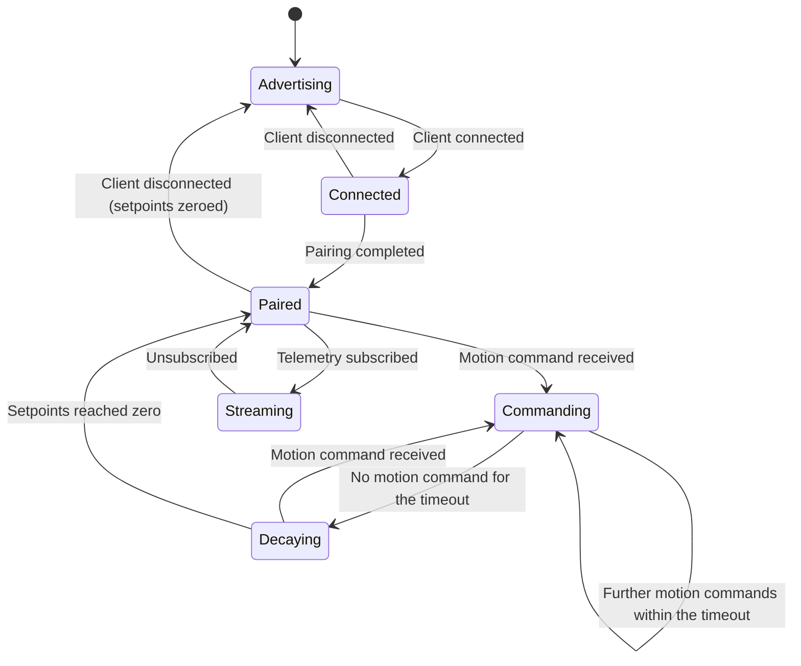
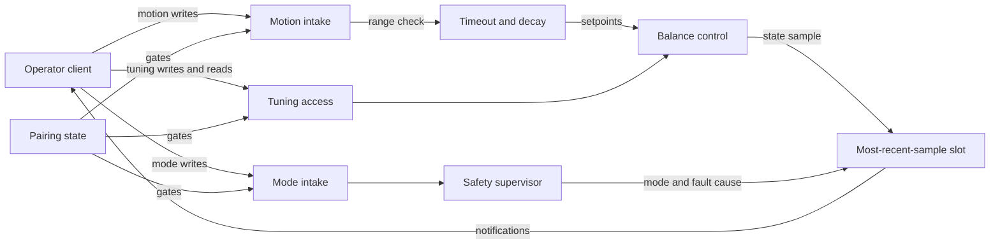

| Field     | Value              |
|-----------|--------------------|
| Title     | BLE Service Design |
| Type      | design             |
| Status    | draft              |
| Version   | 0.2.0              |
| Component | ble-service        |
| Date      | 2026-09-24         |

> The robot's only window on the world. Designed on the assumption that the link will
> fail at the worst moment, and that losing it must never drop a balancing robot.

---

## Responsibilities

**Is responsible for:**
- Presenting the robot control service as a GATT server and managing advertising and
  connection lifecycle.
- Carrying motion setpoints inward, and range-checking them before they reach the controller.
- Decaying setpoints to zero on operator silence, and zeroing them on link loss.
- Carrying mode commands — arm, disarm, clear fault — inward to the safety supervisor.
- Streaming telemetry outward to a subscribed client without ever blocking the control loop.
- Carrying strategy selection and parameter access between the client and balance control.
- Enforcing that no commanding write is honoured before pairing.

**Is NOT responsible for:**
- Deciding whether a command is permitted by the current mode — it forwards and reports
  the outcome; the supervisor and the controller decide.
- Interpreting parameters. It transports opaque values against a descriptor the controller
  supplies.
- Persisting anything.
- Balancing. A link failure is not a control event.

---

## Component Details

### Part A — Service layout

One service carries four characteristic groups, separated by direction and lifetime rather
than by feature, so that a congested or dropped link degrades predictably:

- **Motion** — written frequently by the client while driving. The only high-rate inbound path.
- **Mode** — written rarely, with high consequence. Arm, disarm, clear fault, plus the
  readable mode and latched fault cause.
- **Telemetry** — notified outward at a fixed rate while subscribed. Never written.
- **Tuning** — the active strategy, the list of available strategies, the parameter
  descriptor, and indexed parameter access.

### Part B — The command timeout

A balancing robot driving forward on a stale setpoint will keep going until it hits
something. The inbound motion path therefore carries a deadline: if no motion command
arrives within the timeout, the setpoints decay towards zero.

Decay rather than a hard cut. Instantaneously zeroing the velocity setpoint of a leaning
robot demands a violent pitch correction; ramping it down lets the balance loops bring the
body upright as the robot slows. The ramp is a fixed deceleration — 0.5 metres per second squared
and 1.6 radians per second squared — so braking feels the same from any speed; from full speed the
robot stops in about two seconds. The robot keeps balancing throughout — the timeout removes
the *motion* command, not the *balancing* function.

### Part C — Link loss is not a fault

Losing the connection while ARMED zeroes the setpoints and leaves the robot balancing in
place. This is deliberate: disarming on disconnection would drop the robot every time the
operator walked out of range, and dropping a robot is strictly worse than leaving it
standing. The operator reconnects and takes control again, or disarms it when they arrive.

### Part D — Telemetry without backpressure

Telemetry is produced on the control loop and consumed by a link that may stall for tens of
milliseconds. The rule is that the producer never waits: a single most-recent sample is held
for transmission, and if the link cannot take it before the next one is ready, the older
sample is overwritten and lost. Dropping telemetry is free; delaying the control loop is not.

Each published sample is captured from a single control iteration, so the client never sees
a pitch from one moment beside an effort from another. A recorder observes every balance
iteration after the supervisor and balance control have run, and keeps the estimate, the measured
chassis motion, the effort actually applied, and the mode and fault cause as one sample. The link
reads that sample when it is time to notify.

### Part E — Generic tuning

The controller supplies a descriptor of the active strategy's parameters; this component
transports it. Parameters are addressed by index, and the descriptor supplies the count,
identity and permitted range. A client can therefore tune a strategy that did not exist when
the client was written, and selecting a different strategy simply changes the descriptor.

### Part F — Pairing

Any write that commands motion, changes mode, or modifies tuning requires a paired
connection. An unpaired client may discover the service and read, but cannot move the robot.

Pairing is Just Works with encryption: it needs no input on either side, and every commanding
characteristic demands an encrypted link, which the Bluetooth stack enforces before a write reaches
the application. Just Works does not protect the pairing exchange itself against a man in the
middle; that is accepted for an operator robot that is paired within arm's reach. Bonds are held in
volatile memory until non-volatile storage exists, so a client pairs again after every reset. The
tuning control point is itself a commanding characteristic, so tuning queries also need pairing.

### Part G — Attribute MTU

Every value is carried in little-endian IEEE 754 single precision, which a client decodes directly.
The larger values do not fit the default 23-byte attribute MTU, so the robot requests the largest MTU
the stack supports, 251 bytes, as soon as a client connects. Until the exchange has raised the MTU
enough, telemetry is not sent and tuning responses carry only their status.

### Part H — Wire format

All UUIDs share the base `c7a1xxxx-5f6e-4d2b-9a3c-8e1f4b6d2a70`.

| Characteristic | UUID prefix | Properties             | Value                                                                                    |
|----------------|-------------|------------------------|------------------------------------------------------------------------------------------|
| Service        | c7a10001    | —                      | —                                                                                        |
| Motion         | c7a10002    | write without response | velocity float32 (m/s), yaw rate float32 (rad/s)                                         |
| Mode           | c7a10003    | read, write, notify    | written: one command byte; read: mode, cause, last command, last outcome                 |
| Telemetry      | c7a10004    | read, notify           | pitch, pitch rate, velocity, yaw rate, effort left, effort right as float32; mode, cause |
| Tuning         | c7a10005    | write, notify          | request and response, below                                                              |

| Code | Mode        | Code | Latched cause     | Code | Command    | Code | Outcome  |
|------|-------------|------|-------------------|------|------------|------|----------|
| 0    | INIT        | 0    | None              | 1    | Arm        | 0    | None yet |
| 1    | CALIBRATING | 1    | Fall              | 2    | Disarm     | 1    | Accepted |
| 2    | IDLE        | 2    | DriverFault       | 3    | ClearFault | 2    | Refused  |
| 3    | ARMED       | 3    | EstimateInvalid   | 4    | Calibrate  |      |          |
| 4    | FAULT       | 4    | LoopStalled       |      |            |      |          |
|      |             | 5    | SelfTestFailed    |      |            |      |          |
|      |             | 6    | CalibrationFailed |      |            |      |          |

Tuning requests start with an operation byte and an index byte; every response repeats both and
adds a status: 0 accepted, 1 refused by balance control, 2 invalid request, 3 MTU too small.

| Operation              | Request                 | Response after the status                                              |
|------------------------|-------------------------|------------------------------------------------------------------------|
| 1 — describe strategy  | index                   | strategy count, active index, name length, name                        |
| 2 — select strategy    | index                   | nothing                                                                |
| 3 — describe parameter | index                   | parameter count, value, minimum, maximum as float32, name length, name |
| 4 — write parameter    | index, value as float32 | stored value as float32                                                |

A request that arrives while the previous response is still being sent is ignored; the client waits
for each response before sending the next request.

---

## Interfaces

### Provided

| Interface              | Purpose                                                                        | Contract                                                                                                  |
|------------------------|--------------------------------------------------------------------------------|-----------------------------------------------------------------------------------------------------------|
| Robot control service  | The GATT service exposing all four characteristic groups                       | Discoverable while connected; single client                                                               |
| Advertising lifecycle  | Advertise while unconnected, resume after disconnection                        | At most one concurrent connection; a second is refused                                                    |
| Motion command intake  | Accept velocity and yaw-rate setpoints                                         | Pairing required; out-of-range values rejected, not clamped; setpoints decay to zero after the timeout    |
| Mode command intake    | Accept arm, disarm and clear-fault                                             | Pairing required; forwarded to the supervisor, which applies its own preconditions                        |
| Telemetry notification | Publish robot state to a subscriber                                            | Fixed rate while subscribed; silent otherwise; never blocks the control loop; samples internally coherent |
| Tuning access          | Strategy list, active strategy, parameter descriptor, indexed parameter access | Pairing required for writes; the controller decides acceptance and this component reports the outcome     |

### Required

| Interface            | Purpose                                                  | Contract                                                                  |
|----------------------|----------------------------------------------------------|---------------------------------------------------------------------------|
| Bluetooth peripheral | Advertising, connection, pairing, GATT database          | Connection loss is observable to the application                          |
| Safety supervisor    | Forward mode commands; read mode and latched fault cause | The supervisor may reject any command; rejection is reported, not retried |
| Balance control      | Deliver setpoints; access strategies and parameters      | Rejected writes leave stored values unchanged                             |
| Telemetry source     | Obtain a coherent state sample                           | Sampled from one control iteration; non-blocking                          |
| Timebase             | Telemetry cadence and command timeout                    | Monotonic                                                                 |

---

## Data Model

| Entity         | Field                    | Type / Unit                           | Range                                                                                    | Notes                                    |
|----------------|--------------------------|---------------------------------------|------------------------------------------------------------------------------------------|------------------------------------------|
| Motion command | velocitySetpoint         | metres per second                     | -1.0 to 1.0                                                                              | Out-of-range rejected                    |
| Motion command | yawRateSetpoint          | radians per second                    | -1.6 to 1.6                                                                              | Out-of-range rejected                    |
| Motion command | timeout                  | milliseconds                          | 500                                                                                      | Silence beyond this decays the setpoints |
| Mode           | activeMode               | enumeration                           | INIT, CALIBRATING, IDLE, ARMED, FAULT                                                    | Read-only to the client                  |
| Mode           | latchedCause             | enumeration                           | None, Fall, DriverFault, EstimateInvalid, LoopStalled, SelfTestFailed, CalibrationFailed | Meaningful in FAULT                      |
| Mode command   | command                  | enumeration                           | Arm, Disarm, ClearFault, Calibrate                                                       | Write-only; outcome reported             |
| Telemetry      | pitch, pitchRate         | radians, radians per second           | as estimated                                                                             | From one control iteration               |
| Telemetry      | forwardVelocity, yawRate | metres per second, radians per second | as measured                                                                              | From the same iteration                  |
| Telemetry      | effortLeft, effortRight  | normalised effort                     | -1.0 to 1.0                                                                              | From the same iteration                  |
| Telemetry      | rate                     | notifications per second              | 25                                                                                       | While subscribed                         |
| Tuning         | strategyList             | list of identifiers                   | at least 2 entries                                                                       | Fixed at build time                      |
| Tuning         | activeStrategy           | identifier                            | one of strategyList                                                                      | Writable only while not ARMED            |
| Tuning         | parameterDescriptor      | count, identity and range per index   | strategy-defined                                                                         | Changes when the active strategy changes |
| Tuning         | parameterValue           | value at an index                     | within the published range                                                               | Writable only while not ARMED            |

---

## State Machine



---

## Sequence Diagrams

Connect, pair, arm, drive.

```mermaid
sequenceDiagram
    participant Op as Operator client
    participant Link as BLE service
    participant Sup as Safety supervisor
    participant Ctrl as Balance control

    Op->>Link: Connect
    Op->>Link: Pair
    Link-->>Op: Paired
    Op->>Link: Subscribe to telemetry
    Op->>Link: Arm
    Link->>Sup: Arm request
    Sup-->>Link: Mode = ARMED
    Link-->>Op: Mode notification
    loop While driving
        Op->>Link: Velocity and yaw setpoint
        Link->>Ctrl: Setpoints
        Ctrl-->>Link: State sample
        Link-->>Op: Telemetry notification
    end
```

Operator falls silent, then the link drops.

```mermaid
sequenceDiagram
    participant Op as Operator client
    participant Link as BLE service
    participant Ctrl as Balance control

    Note over Op,Link: No motion command for 500 ms
    Link->>Ctrl: Decay setpoints towards zero
    Note over Ctrl: Robot slows, keeps balancing
    Note over Op,Link: Connection lost
    Link->>Ctrl: Setpoints = zero
    Note over Ctrl: Mode remains ARMED, robot balances in place
    Link->>Link: Resume advertising
```

---

## Block Diagram



---

## Constraints & Limitations

| Constraint                  | Value / Description                                                                                   |
|-----------------------------|-------------------------------------------------------------------------------------------------------|
| Single client               | One concurrent connection; a second is refused rather than queued                                     |
| Command timeout             | 500 ms of silence begins setpoint decay                                                               |
| Telemetry rate              | 25 notifications per second while subscribed                                                          |
| Non-blocking                | Telemetry production must never delay the balance loop; stale samples are dropped                     |
| Bounded buffers             | One most-recent sample is held; there is no unbounded transmit queue                                  |
| Link is not safety-critical | Loss of the link zeroes motion but never disarms; no safety function depends on it                    |
| Range, not latency          | Connection interval bounds how quickly a command takes effect; the control loops are unaffected by it |
| Parameters by index         | Reordering a strategy's parameters breaks previously stored values                                    |

---

## Open Questions

| # | Question                                                                                 | Options                                                                                      | Status                              |
|---|------------------------------------------------------------------------------------------|----------------------------------------------------------------------------------------------|-------------------------------------|
| 1 | Which pairing association model?                                                         | Just-works — simplest, no authenticated protection; passkey — needs an input or display path | decided: Just Works with encryption |
| 2 | Should the setpoint decay be a fixed ramp time or a fixed deceleration?                  | Fixed ramp; fixed deceleration matched to the balance envelope                               | decided: fixed deceleration         |
| 3 | Should telemetry rate be negotiable by the client?                                       | Fixed at 25 per second; client-selectable within bounds                                      | decided: fixed at 25 per second     |
| 4 | Should motion and mode commands share one characteristic to save a round trip?           | Separate — different rates and consequences; combined                                        | decided: separate                   |
| 5 | Should the service expose a diagnostic log, or is telemetry plus fault cause sufficient? | Telemetry only; add a fault history                                                          | decided: telemetry only             |
