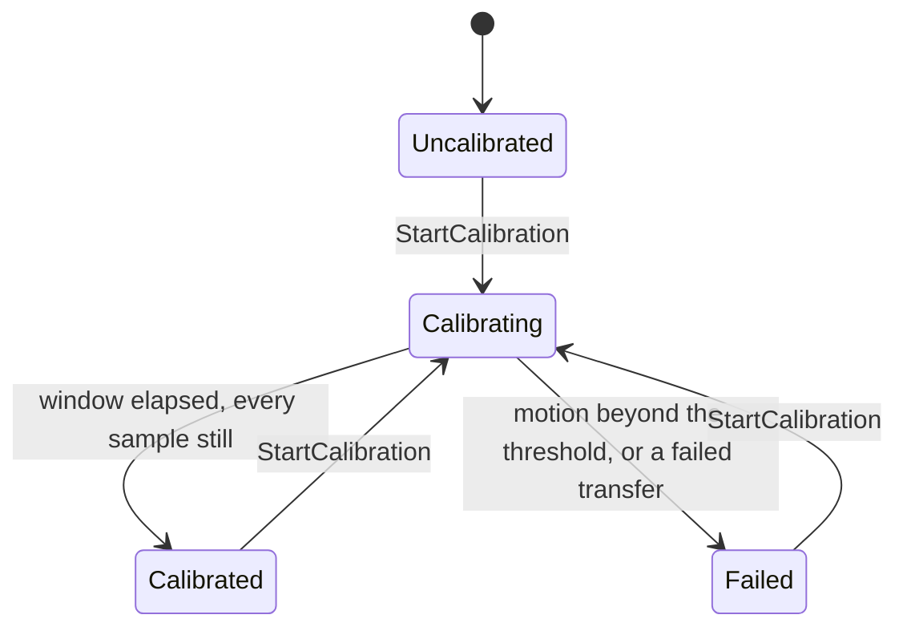
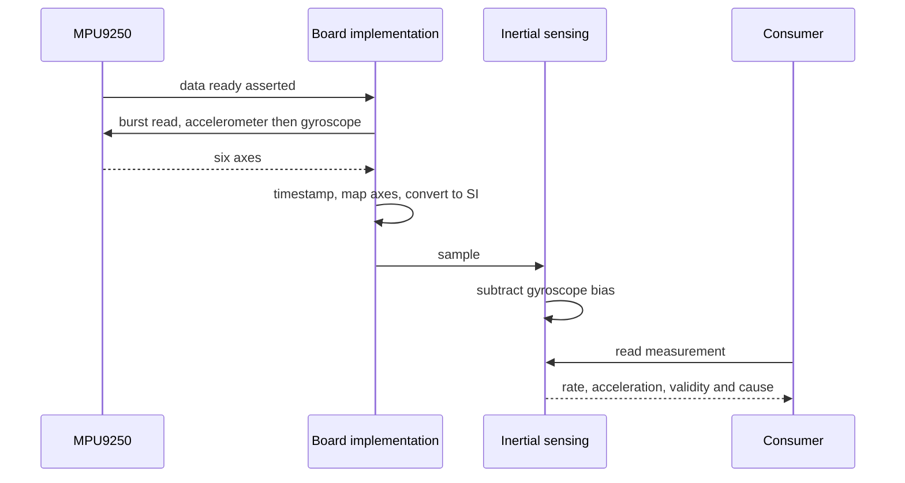
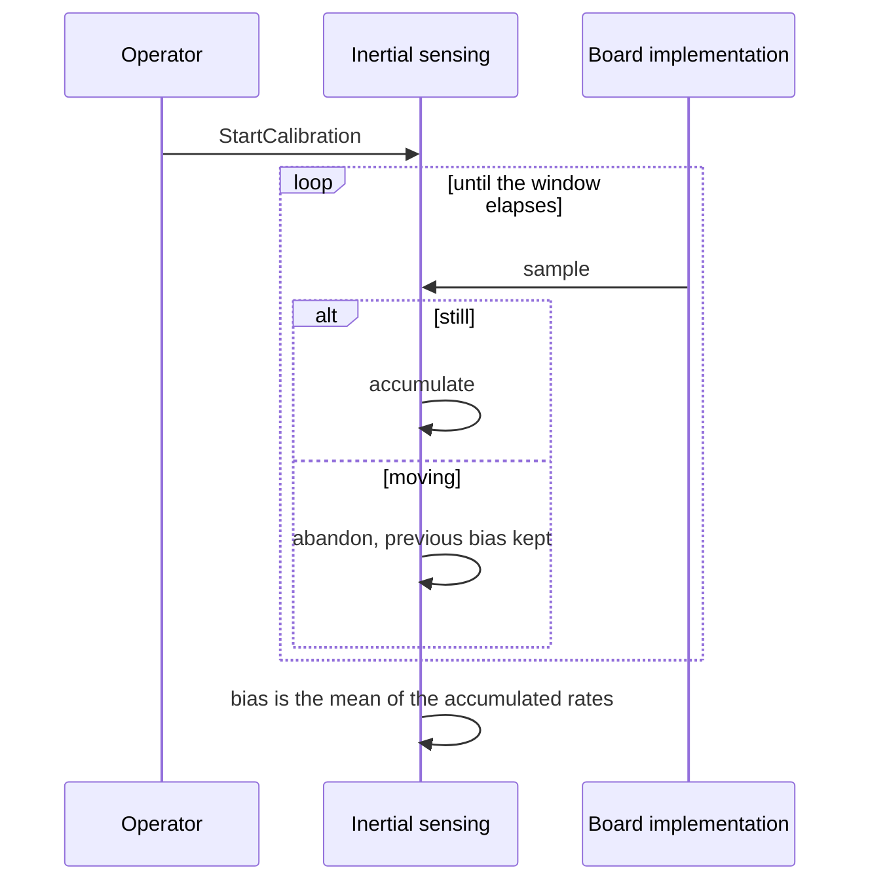
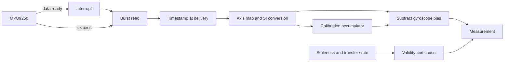

| Field     | Value                   |
|-----------|-------------------------|
| Title     | Inertial Sensing Design |
| Type      | design                  |
| Status    | draft                   |
| Version   | 0.1.0                   |
| Component | imu-sensing             |
| Date      | 2026-09-19              |

> Turns a six-axis part on a serial bus into bias-corrected angular rate and acceleration in a
> fixed body frame, each sample carrying the instant it was taken and an explicit statement of
> whether it may be believed.

---

## Responsibilities

**Is responsible for:**

- Estimating the gyroscope bias of each axis while the robot is held still, and subtracting it
  from every subsequent sample.
- Refusing to calibrate when the robot is not still, and reporting that refusal.
- Marking its output invalid when no sample has arrived for more than three sampling periods.
- Marking its output invalid when a sample is flagged as a failed transfer, rather than
  publishing a value. On the ST board nothing raises that flag today — see **Constraints**.
- Publishing a validity indication, and the reason for invalidity, with every measurement.

**Is NOT responsible for:**

- Talking to the part. The driver and the board implementation do that; this component consumes
  a portable role.
- Fusing anything. Pitch comes from attitude estimation, which consumes this component.
- Deciding what an invalid measurement means for the drive. The safety supervisor decides that.
- Choosing the sampling cadence. The sensor's own data-ready output sets it.

---

## Component Details

### Part A — The part, and what was already written

The fitted part is an **MPU9250**: a three-axis gyroscope and three-axis accelerometer, with an
AK8963 magnetometer in the same package. The magnetometer is **not used**. It sits behind the
part's auxiliary I2C bus, the vendored driver has no support for it, and the estimation theory
establishes that yaw has no absolute reference in this robot and is not integrated. It is present
on the die and absent from the design.

The driver itself was not written for this project. `embedded-infra-lib` vendors a complete,
tested MPU9250 driver — bus-agnostic core, SPI and I2C adapters, a data-ready interrupt path,
self-test and FIFO mixins, and an identification read. What this component adds is everything
around it: the bus and pins, the frame and units, calibration, and validity.

### Part B — Sampling is driven by the sensor, not by a loop

The part asserts a data-ready line when a new sample is latched. That line is wired to an
interrupt and the sample is read in response.

The sample is timestamped when the driver delivers it, which is one burst later than the edge
that latched it — about 120 µs at the bus clock below, plus event-dispatch latency. That is a
near-constant offset rather than jitter, and it is stated here because the design would
otherwise claim the timestamp is the capture instant when it is the delivery instant. Closing
the gap means timestamping inside the driver's interrupt handler, which is a change to the
vendored driver rather than to this component.

The alternative — polling on a periodic timer — was rejected. Both the estimator's required
interface and the platform timebase contract say the *measured* interval is what consumers get,
never the nominal one, and the estimation theory names sampling-interval jitter as its third
largest error source because Δt enters the integration directly. Polling at a rate unrelated to
the sensor's own cadence produces samples of varying and unknown age, and reports an interval
that is the poller's rather than the sensor's. That was the exact defect corrected in wheel
odometry, and repeating it here would be worse: the pitch estimate integrates this signal.

This answers the platform abstraction's open question about whether the inertial role exposes
raw samples or a board-driven callback. It is a callback. The board owns the cadence because the
part owns the cadence.

### Part C — The body frame

The platform abstraction declares the axis convention binding but never states it. It is fixed
here, and the estimation theory forces the choice: with the accelerometer model
`[a_x; a_z] = [-g sinθ; -g cosθ]` and `θ = atan2(-a_x, -a_z)`, upright must read `-g` on z.

| Axis | Direction |
|------|-----------|
| x    | Forward   |
| y    | Left      |
| z    | Up        |

Right-handed. The accelerometer reports the gravity vector, so at rest and upright the z axis
reads about -9.81 m/s². Positive pitch is nose-up, a rotation about y.

The mapping from the part's own axes to these is a signed permutation held by the board
implementation, defaulting to identity. **Which permutation is correct depends on how the part is
physically mounted, and nothing in this repository can establish that.** It is a value to be set
when the sensor is fitted and verified by tilting the robot, in the same way the wheel geometry
is a fitted value rather than a measured one.

### Part D — Units are converted at the board boundary

The driver reports milli-degrees per second and milli-metres per second squared as integers.
Every specification in this project is SI — radians per second and metres per second squared —
and so is the estimator that consumes this. The conversion happens in the board implementation,
beside the axis mapping, because both are properties of the part rather than of the robot.

### Part E — Calibration belongs here, not to the estimator

The gyroscope's bias is a slowly varying offset that integration turns into unbounded drift; the
theory puts an uncalibrated bias of 0.02 rad/s at 34 degrees of error after thirty seconds. It
must be removed, and it is removed here.

This was a contradiction in the specifications: the requirements assign bias estimation and
subtraction to the sensing component, while the attitude estimation design listed it among the
estimator's responsibilities. The requirements win, and the estimation design document is
corrected to match. The reasoning beyond precedence: the architecture already describes this
component as producing *calibrated* measurements, and an estimator that receives a corrected rate
is a pure fusion filter rather than one carrying a calibration mode of its own.

Calibration averages the angular rate over a window while checking two things. Every sample must
stay within a stillness threshold: a sample beyond it abandons the attempt, because an average
taken while the robot moves is not a bias — it is motion, and subtracting it would bias the
estimate permanently. And no gap between consecutive samples may exceed the bound that decides
staleness. That second check matters because the window closes on elapsed time rather than on a
count of samples; without it, one sample, a stall, and a second sample a second later would be
accepted as a bias drawn from two readings, when the whole point of a window is that averaging
several hundred shrinks the noise. A failed attempt leaves the previous bias untouched.

### Part F — Validity has a cause

A consumer that learns only that a measurement is unusable cannot tell a sensor that has never
been read from one that has stopped answering. Each measurement therefore carries not just a
validity flag but the reason, distinguishing: never sampled, stale, transfer failed, and not yet
calibrated.

Staleness is evaluated when the measurement is read, not when a sample arrives. This matters: if
the sensor stops entirely, no callback arrives to notice, and a validity computed only on arrival
would stay true forever at exactly the moment it stopped being true.

---

## Interfaces

### Provided

| Interface            | Purpose                                          | Contract                                                                                                 |
|----------------------|--------------------------------------------------|----------------------------------------------------------------------------------------------------------|
| Inertial measurement | Bias-corrected angular rate and acceleration     | Body frame, SI units, carries the sample instant; invalid unless fresh, calibrated and read successfully |
| Validity and cause   | Whether the measurement may be believed, and why | Invalid is never merely degraded; the cause distinguishes stale from failed from uncalibrated            |
| Calibration control  | Begin bias calibration and report its outcome    | Failure leaves the previous bias unchanged; a new attempt may be started at any time                     |

### Required

| Interface       | Purpose                                      | Contract                                                                          |
|-----------------|----------------------------------------------|-----------------------------------------------------------------------------------|
| Inertial sensor | Six-axis samples in the body frame           | Pushed as they are produced, timestamped at delivery, flagged on transfer failure |
| Timebase        | Judging staleness and the calibration window | Monotonic; the measured instant is used, never a nominal one                      |

---

## Data Model

| Entity        | Field              | Type / Unit               | Range                                                   | Notes                                                                          |
|---------------|--------------------|---------------------------|---------------------------------------------------------|--------------------------------------------------------------------------------|
| Measurement   | angularRate        | radians per second        | -8.7 to 8.7                                             | Body frame, bias-corrected                                                     |
| Measurement   | acceleration       | metres per second squared | -39 to 39                                               | Body frame, uncorrected                                                        |
| Measurement   | sampledAt          | time point                | monotonic                                               | Taken when the driver delivers the sample, one burst after the data-ready edge |
| Measurement   | valid              | boolean                   | true or false                                           | False means unusable, not degraded                                             |
| Measurement   | cause              | enumeration               | none, neverSampled, stale, transferFailed, uncalibrated | Why an invalid measurement is invalid                                          |
| Calibration   | gyroBias           | radians per second        | -0.17 to 0.17                                           | One per axis, re-estimated each power-on                                       |
| Calibration   | window             | milliseconds              | 500 to 2000                                             | Averaging window                                                               |
| Calibration   | stillnessThreshold | radians per second        | fitted value                                            | Exceeding it during the window fails the attempt                               |
| Configuration | samplePeriod       | microseconds              | greater than zero                                       | Expected cadence; only staleness is judged by it                               |
| Configuration | stalePeriods       | count                     | greater than zero                                       | Periods without a sample before invalidity                                     |

---

## State Machine

Calibration is the only state this component carries beyond the last sample.

Measurements are invalid in every state but Calibrated.

---

## Sequence Diagrams

Steady-state sampling:

Calibration:

---

## Block Diagram

---

## Constraints & Limitations

| Constraint                                  | Value / Description                                                                                                                                                                                                                                                                                                                                                      |
|---------------------------------------------|--------------------------------------------------------------------------------------------------------------------------------------------------------------------------------------------------------------------------------------------------------------------------------------------------------------------------------------------------------------------------|
| Sample rate                                 | 1 kHz, set by the part's own divider. The requirement asks for at least 500 Hz; a nominal 500 would sit below it whenever the internal oscillator runs slow, so the rate is doubled rather than left on the boundary                                                                                                                                                     |
| Bus clock                                   | 1 MHz. The part permits 20 MHz only for sensor and interrupt registers and 1 MHz elsewhere, and the adapter does not switch clocks per transaction, so the whole bus runs at the lower rate                                                                                                                                                                              |
| Transfer cost                               | About 120 µs per sample at 1 MHz for fifteen bytes, roughly 12% of one core at 1 kHz. Measured on paper, not on hardware                                                                                                                                                                                                                                                 |
| Bias is estimated once                      | Per power-on, and not tracked against temperature. A long run that warms up will drift                                                                                                                                                                                                                                                                                   |
| Stillness is judged by rate                 | Only angular rate is checked; a robot translating smoothly at constant velocity would pass                                                                                                                                                                                                                                                                               |
| Magnetometer unused                         | The AK8963 in the package is not read, so there is no absolute heading reference                                                                                                                                                                                                                                                                                         |
| Transfer failure is invisible on this board | The SPI interface this driver sits on reports completion with no status, so a failed transfer cannot be told from a slow one. In practice a failure means no sample arrives and the output goes stale. REQ-IMU-006 is therefore only partly met on the ST board: no measurement is propagated, but the condition surfaces as staleness rather than as a transfer failure |
| Timestamp offset                            | `sampledAt` is the delivery instant, about 120 µs after the data-ready edge — see Part B                                                                                                                                                                                                                                                                                 |
| Single interrupt line                       | Interrupt lines are keyed by pin number across all ports on this part, so the data-ready pin's number must stay unique                                                                                                                                                                                                                                                   |
| No heap, no recursion                       | Fixed-size state, no dynamic allocation on any path                                                                                                                                                                                                                                                                                                                      |

---

## Open Questions

| # | Question                                                                                    | Options                                                                                                      | Status                                   |
|---|---------------------------------------------------------------------------------------------|--------------------------------------------------------------------------------------------------------------|------------------------------------------|
| 1 | What is the sensor-to-body axis permutation for the fitted part?                            | Determine by tilting the assembled robot; read it off the mechanical drawing                                 | open — identity until hardware exists    |
| 2 | Is the stillness threshold right, and should it also bound acceleration?                    | Fit from a bench recording of the robot at rest; add an acceleration bound                                   | open — placeholder value                 |
| 3 | Should a failed identification read raise a fault rather than simply never sampling?        | Raise it through the safety supervisor once that component exists                                            | open — the supervisor does not exist yet |
| 4 | Does 12% of a core for transfers survive contact with the control loop?                     | Measure on target; drop to 500 Hz; switch bus clocks per transaction                                         | open — unmeasured                        |
| 5 | How should a failed SPI transfer become visible, given the bus interface reports no status? | Extend the bus interface with a completion status; time out a transfer in the adapter; leave it as staleness | open — staleness only, today             |
| 6 | Should the timestamp be taken at the data-ready edge inside the driver?                     | Change the vendored driver to stamp in its handler; accept the constant delivery offset                      | open — offset accepted and documented    |
