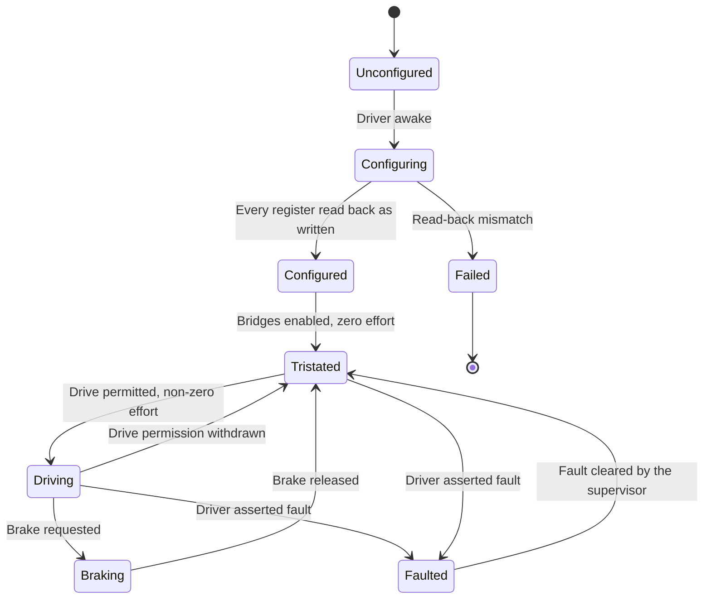
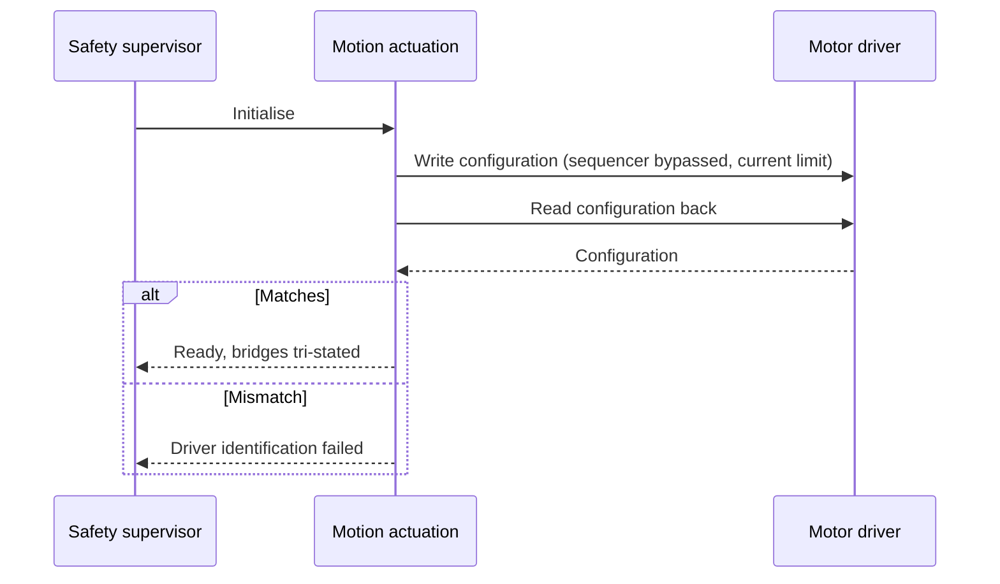
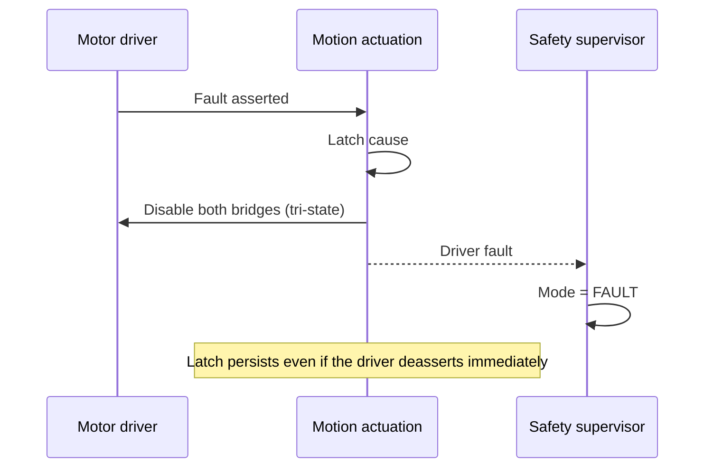
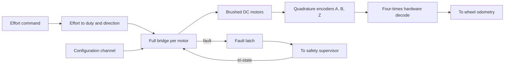

| Field     | Value                   |
|-----------|-------------------------|
| Title     | Motion Actuation Design |
| Type      | design                  |
| Status    | draft                   |
| Version   | 0.2.0                   |
| Component | motion-actuation        |
| Date      | 2026-09-24              |

> Turns an abstract effort command into current through two motors. The one component that
> must always be able to stop, whatever else has failed. What the wheels then did is measured
> by wheel odometry, which is a separate component with its own design document.

---

## Responsibilities

**Is responsible for:**
- Configuring the motor driver at startup and verifying the configuration by read-back.
- Driving both full bridges directly, bypassing the driver's internal step sequencer.
- Mapping a signed effort command onto bridge duty cycle and direction.
- Providing tri-state and brake disable states, and guaranteeing the tri-state is always reachable.
- Observing the driver's fault output and reporting it to the safety supervisor.

**Is NOT responsible for:**
- Measuring what the wheels did. Wheel position, wheel velocity and chassis motion belong to
  the wheel odometry component; this component allocates the encoder timers and fixes the
  sign convention, and stops there.
- Deciding what effort to apply, or whether the drive may be energised.
- Interpreting a fault beyond latching and reporting it.
- Estimating body attitude.
- Closing a current or velocity loop around the motors; effort maps to duty open-loop, and
  the outer loops live in balance control.

---

## Component Details

### Part A — One driver, two brushed motors

The motor driver part is nominally a stepper driver, but a stepper driver *is* two
independent full H-bridges plus a step sequencer. Bypassing the sequencer and driving the
two bridges directly yields exactly what a two-wheeled balancer needs: two independently
commanded brushed DC motors, per-motor current regulation, and a single fault output, all
configured over one serial channel. The left motor hangs on the first bridge, the right on
the second.

The consequence for this design is that bridge state is commanded by the firmware on every
control iteration rather than delegated to the part. Each bridge takes **two logic-level
inputs**, so one driver needs four lines in total, and all four are timer outputs: four
channels of a single timer, one per bridge input, with no direction pin anywhere. The part
generates its own gate drive and its own dead time, so the timer supplies plain logic-level
PWM: no complementary outputs, and no dead-time generator on the microcontroller side.

Putting all four inputs on one timer has three consequences the rest of the design leans on:

- **Both motors switch in phase.** One counter drives every edge, so the two bridges are
  phase-locked, and all four compares are written in one step. The counter runs
  centre-aligned, which halves current ripple against edge alignment at the same switching
  frequency.
- **Direction changes are glitch-free.** Compare preload is enabled, so a new command takes
  effect as a whole at the next period boundary. Reversing a motor swaps which input is held
  and which is switched in one update; there is no intermediate period in which the old
  magnitude is applied in the new direction.
- **The hardware stop owns every input.** The driver's fault output feeds the timer's break
  input. A break forces all four outputs to their idle level, which is low, and both inputs
  low is the tri-state. The release therefore does not depend on the commanded direction,
  on firmware, or on any gate outside the timer.

Which two states a bridge alternates between is the decay mode, and it is a firmware choice
made per command, not a wiring choice:

| Decay | Forward effort *e*                    | Reverse effort *e*                        | Off-time state        |
|-------|---------------------------------------|-------------------------------------------|-----------------------|
| Slow  | input 1 held high, input 2 at 1 − *e* | input 1 at 1 − \|*e*\|, input 2 held high | both legs low (brake) |
| Fast  | input 1 at *e*, input 2 held low      | input 1 held low, input 2 at \|*e*\|      | released (tri-state)  |

Slow decay is the default. It keeps the motor current continuous down to small efforts, so
torque stays proportional to effort through the zero crossing a balancer lives around, and
at zero effort nothing switches at all. Fast decay lets current collapse during the off-time,
which makes small efforts non-linear, and is kept for comparison on the bench.

### Part B — Configuration and verification

Driver configuration is written during INIT and read back: control (sense gain, dead time,
enable), torque (current-limit setting), off-time with the sequencer bypass, blanking, decay,
stall and gate drive. Every register written is read back and compared; the one field the part
documents as write-only is masked. Only when every register matches are the latched status
flags cleared and the enable bit set — the bridges can only be energised through a
configuration that has been verified.

A driver that does not read back what was written is treated as absent, not as merely
misconfigured: energising motors through a driver in an unknown state is the failure mode this
check exists to prevent. Until configuration completes, and forever after it fails, effort and
brake commands are refused; the tri-state is always accepted.

The current limit is expressed as a trip current. The part trips at a reference voltage times
the torque setting, divided by 256 times the sense gain times the sense resistance. The sense
gain is chosen as the highest of its four values for which the torque setting still fits its
eight bits, which keeps the most resolution. Sense resistance and the motor's continuous rating
are board facts; until they are known the configured limit is deliberately conservative.

### Part C — Effort to duty mapping

Effort arrives normalised and signed. Its magnitude selects duty cycle, its sign selects which
input is switched, per the decay table in Part A. The mapping is monotonic and documented, so
that a change in commanded effort always produces a change in the same direction at the wheel —
a property the control strategies rely on and none of them verify. Duty is carried at the
timer's resolution, not rounded to whole percent.

Switching frequency sits above the audible band and is matched to the motor's electrical
time constant: too low and the robot whines and the current ripples; too high and switching
losses dominate.

### Part D — Tri-state, brake, and why safety uses the tri-state

Tri-stating opens both bridge legs, leaving the motor terminals floating; the robot's wheels
turn freely. Braking shorts the terminals, dissipating kinetic energy and resisting motion.

Both states are reached through the same two inputs, and the encoding is easy to get
backwards — driving both inputs low is a *tri-state*, not a brake:

| Input 1 | Input 2 | Bridge         | Meaning   |
|---------|---------|----------------|-----------|
| low     | low     | released       | Tri-state |
| high    | low     | driven forward | Forward   |
| low     | high    | driven reverse | Reverse   |
| high    | high    | both legs low  | Brake     |

Safety-initiated disables always tri-state. A falling robot that brakes plants its wheels and
converts a topple into a harder impact, and braking still drives current through the
bridges at the moment a fault is suspected. The tri-state is also what the hardware reaches
without firmware cooperation, which is what makes it reachable when the control loop is
already gone. A brake requested while a fault is latched is refused for the same reason.

### Part E — Encoder decoding is configured here and consumed elsewhere

Each encoder's A and B channels are decoded by a hardware counter in four-times quadrature,
counting every edge on both channels for maximum resolution. Configuring those timers is part
of bringing up the platform, so it is described here beside the timer budget it competes for.

Two decisions made at that configuration are contracts the wheel odometry component relies on
and must not repeat. The counter resolution bounds the wrap that odometry reconstructs. And
because the two wheels are mirrored physically, one encoder is configured with an inverted
phase, so both count up for forward robot motion and no sign correction is applied downstream.

Everything past the counter — accumulation across wrap, wheel velocity, chassis motion — is
the wheel odometry component's, and is described in `documentation/design/wheel-odometry.md`.

---

## Interfaces

### Provided

| Interface          | Purpose                                 | Contract                                                                                    |
|--------------------|-----------------------------------------|---------------------------------------------------------------------------------------------|
| Effort application | Apply a signed effort to each motor     | Monotonic mapping to duty and direction; ignored unless the drive is permitted              |
| Drive disable      | Tri-state or brake both bridges         | The tri-state must succeed without a healthy control loop; safety disables always tri-state |
| Driver health      | Report driver-asserted faults           | Latched on assertion, even if the condition clears immediately                              |
| Wheel encoders     | Access to both decoded encoder counters | Already sign-corrected for the mirrored mounting; consumed by wheel odometry                |

### Required

| Interface                    | Purpose                                  | Contract                                             |
|------------------------------|------------------------------------------|------------------------------------------------------|
| Driver configuration channel | Write and read back driver configuration | Read-back mismatch is a fatal startup condition      |
| Bridge control outputs       | Duty on both inputs of each bridge       | One timer, phase-locked, released by the break input |
| Driver fault input           | Observe the driver's fault assertion     | Observable without polling the configuration channel |
| Encoder channel inputs       | A, B and index per wheel                 | Decoded without losing edges at maximum wheel speed  |

---

## Data Model

| Entity        | Field                   | Type / Unit       | Range                                   | Notes                                      |
|---------------|-------------------------|-------------------|-----------------------------------------|--------------------------------------------|
| Command       | effortLeft, effortRight | normalised effort | -1.0 to 1.0                             | Sign selects direction                     |
| Command       | disableState            | enumeration       | Tri-state, Brake                        | Safety paths use the tri-state exclusively |
| Encoder       | countsPerRevolution     | counts            | fitted value                            | Four times the encoder line count          |
| Configuration | currentLimit            | amperes           | at or below the motor continuous rating | Verified by read-back                      |
| Configuration | switchingFrequency      | kilohertz         | above 20                                | Above the audible band                     |
| Configuration | senseResistance         | milliohms         | fitted value                            | Board fact; sets the current-limit scale   |
| Configuration | decay                   | enumeration       | Slow, Fast                              | Slow by default                            |

---

## State Machine

---

## Sequence Diagrams

Startup configuration.

A driver fault during flight.

---

## Block Diagram

---

## Constraints & Limitations

| Constraint              | Value / Description                                                                                                                    |
|-------------------------|----------------------------------------------------------------------------------------------------------------------------------------|
| Tri-state reachability  | Tri-stating must not depend on the control loop, the estimator or the link                                                             |
| Configuration trust     | An unverifiable driver configuration prevents startup rather than degrading operation                                                  |
| Switching frequency     | Above 20 kHz and compatible with the motor electrical time constant                                                                    |
| Current limit           | At or below the continuous rating of the fitted motors                                                                                 |
| Open-loop torque        | Effort maps to duty, not to current. Torque per unit effort varies with battery voltage and motor speed; the balance loops absorb this |
| No battery compensation | A discharging battery reduces the effort actually delivered; not compensated in this revision                                          |

---

## Open Questions

| # | Question                                                                                                              | Options                                                           | Status                                                                                                  |
|---|-----------------------------------------------------------------------------------------------------------------------|-------------------------------------------------------------------|---------------------------------------------------------------------------------------------------------|
| 1 | Should effort compensate for measured battery voltage so torque per unit effort stays constant as the battery drains? | Leave to the balance loops; add feed-forward compensation         | open                                                                                                    |
| 2 | Fast or slow current decay mode for the bridges?                                                                      | Depends on measured current ripple against motor inductance       | decided — slow by default for linearity through zero effort; fast stays selectable for bench comparison |
| 3 | Should the driver's current regulation be relied upon, or a separate measurement taken?                               | Rely on the driver; add sensing for telemetry and stall detection | open                                                                                                    |
