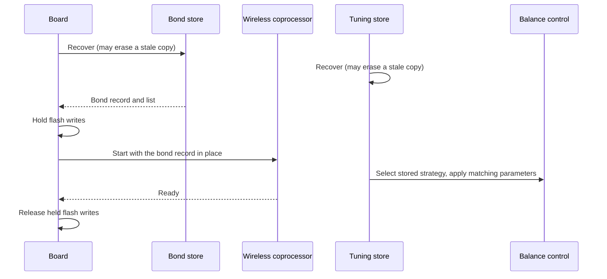
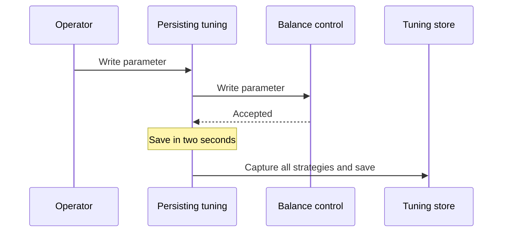

| Field     | Value              |
|-----------|--------------------|
| Title     | Persistence Design |
| Type      | design             |
| Status    | draft              |
| Version   | 0.1.0              |
| Component | persistence        |
| Date      | 2026-09-25         |

> A robot that forgets its tuning at every reset gets tuned once and then abandoned. This component
> keeps the operator's work, and the robot's pairings, across power cycles without ever writing
> flash while the robot is balancing.

---

## Responsibilities

**Is responsible for:**
- Restoring the active strategy and every strategy's parameter values at power-on.
- Saving them after the operator changes them, while the robot is not armed.
- Keeping stored values meaningful when a firmware update adds, removes or reorders parameters.
- Keeping the Bluetooth bonds, so a paired client stays paired after a reset.

**Is NOT responsible for:**
- Deciding whether a change is acceptable. Balance control accepts or refuses; this component only
  stores what was accepted.
- Wear levelling beyond what the configuration store provides. Saves are rare and operator-driven.
- Storing anything the robot measures. Calibration is repeated at every power-on.

---

## Component Details

### Part A — Two stores, two owners

Tuning belongs to the application and bonds belong to the Bluetooth stack, so each has its own
store. Both use the library's configuration store: two copies of a blob in two flash pages, each
verified by a hash, written alternately so a reset during a write leaves the previous copy intact.

| Store  | Owner       | Content                                                         |
|--------|-------------|-----------------------------------------------------------------|
| Tuning | Application | Active strategy name; each strategy's parameters by name        |
| Bonds  | Board       | The stack's bond record and the list of bonded client addresses |

On the selected part the four pages lie between the end of the application image and the start of
the wireless coprocessor's stack, so neither firmware image can overwrite them.

### Part B — Matching by name

Parameters are addressed by index over the link, but they are stored by strategy name and parameter
name. On restore, a stored value is applied only to a parameter that still exists under the same
name in a strategy that still exists under the same name, and only if balance control accepts it. A
parameter added by new firmware keeps its default; one that was removed is ignored; reordering is
harmless. A stored active strategy that no longer exists leaves the default strategy selected.

### Part C — When saving happens

Every accepted strategy selection or parameter write schedules a save two seconds later; further
changes within that window postpone it, so a burst of tuning writes flash once. A save that falls due
while the robot is armed waits until it is disarmed: flash is never erased or written while the robot
is balancing. Tuning writes are already refused while armed, so the deferred save only covers the
moment of arming itself.

### Part D — Bonds follow the stack

The stack reports when its bond record changes; the record is copied into the bond store and saved.
The list of bonded addresses is saved on every change. At power-on both are restored before the
wireless coprocessor starts, so the stack boots with its bonds already in place and the bond
synchroniser sees an identical list on both sides.

### Part E — Boot order on the selected part

Flash writes and erases on this part must be coordinated with the wireless coprocessor, which only
accepts that coordination once it runs, whereas reads are plain memory accesses. Recovering a store
may itself erase a stale copy left by a reset during a write. If writes were held from power-on, that
erase would wait for a coprocessor that cannot start until the bonds are recovered.

So flash access follows the coprocessor through three states:

| State    | When                                           | Writes and erases             |
|----------|------------------------------------------------|-------------------------------|
| Stopped  | From power-on until the coprocessor is started | Carried out immediately       |
| Starting | While the coprocessor boots                    | Held, including one under way |
| Running  | Once the coprocessor reports ready             | Coordinated with it           |

The board recovers the bond store, starts the coprocessor, and releases held writes when it reports
ready. The tuning store recovers in parallel. A save requested while the coprocessor is starting is
carried out once it is ready.

---

## Interfaces

### Provided

| Interface          | Purpose                                     | Contract                                                                      |
|--------------------|---------------------------------------------|-------------------------------------------------------------------------------|
| Persisting tuning  | Balance control that saves accepted changes | Behaves exactly like balance control; saves two seconds after the last change |
| Tuning restoration | Apply stored values at power-on             | Only values that match by name and that balance control accepts are applied   |
| Bond storage       | The stack's bond record and the bonded list | Restored before the stack starts; saved on every change                       |

### Required

| Interface         | Purpose                              | Contract                                                             |
|-------------------|--------------------------------------|----------------------------------------------------------------------|
| Parameter storage | Two flash areas for the tuning store | Readable at power-on; writes may be held until the board allows them |
| Balance control   | Strategy and parameter access        | Refuses changes while armed                                          |
| Safety supervisor | Whether the robot is armed           | Current mode readable at any time                                    |
| Timebase          | The save delay                       | Monotonic                                                            |

---

## Data Model

| Entity    | Field          | Type / Unit           | Range                  | Notes                           |
|-----------|----------------|-----------------------|------------------------|---------------------------------|
| Tuning    | activeStrategy | name                  | up to 16 characters    | Empty until first saved         |
| Tuning    | strategies     | list                  | up to 4                | One entry per strategy          |
| Strategy  | name           | name                  | up to 16 characters    | The strategy's own name         |
| Strategy  | parameters     | list                  | up to 12               | One entry per parameter         |
| Parameter | name           | name                  | up to 16 characters    | The descriptor's name           |
| Parameter | value          | IEEE 754 single       | the descriptor's range | Out-of-range values are refused |
| Bonds     | stackRecord    | bytes                 | 2028                   | Opaque to the application       |
| Bonds     | addresses      | six bytes per address | up to 10 addresses     | Oldest evicted when full        |

---

## Sequence Diagrams

Power-on.

Tuning change.

---

## Constraints & Limitations

| Constraint           | Value / Description                                                                    |
|----------------------|----------------------------------------------------------------------------------------|
| No flash while armed | Saves wait for the robot to be disarmed                                                |
| Save delay           | Two seconds after the last accepted change                                             |
| Integrity            | Each copy is verified by a hash; a corrupt copy falls back to the other or to defaults |
| Name length          | Strategy and parameter names up to 16 characters                                       |
| Capacity             | Up to 4 strategies of up to 12 parameters; up to 10 bonds                              |

---

## Open Questions

| # | Question                                                   | Options                                        | Status                        |
|---|------------------------------------------------------------|------------------------------------------------|-------------------------------|
| 1 | Should saves be automatic or explicit?                     | Automatic after a delay; explicit save command | decided: automatic, debounced |
| 2 | How are stored parameters matched after a firmware update? | By name; by index with a descriptor version    | decided: by name              |
| 3 | Should the operator be able to restore factory defaults?   | CLI and link command; not needed               | open                          |
