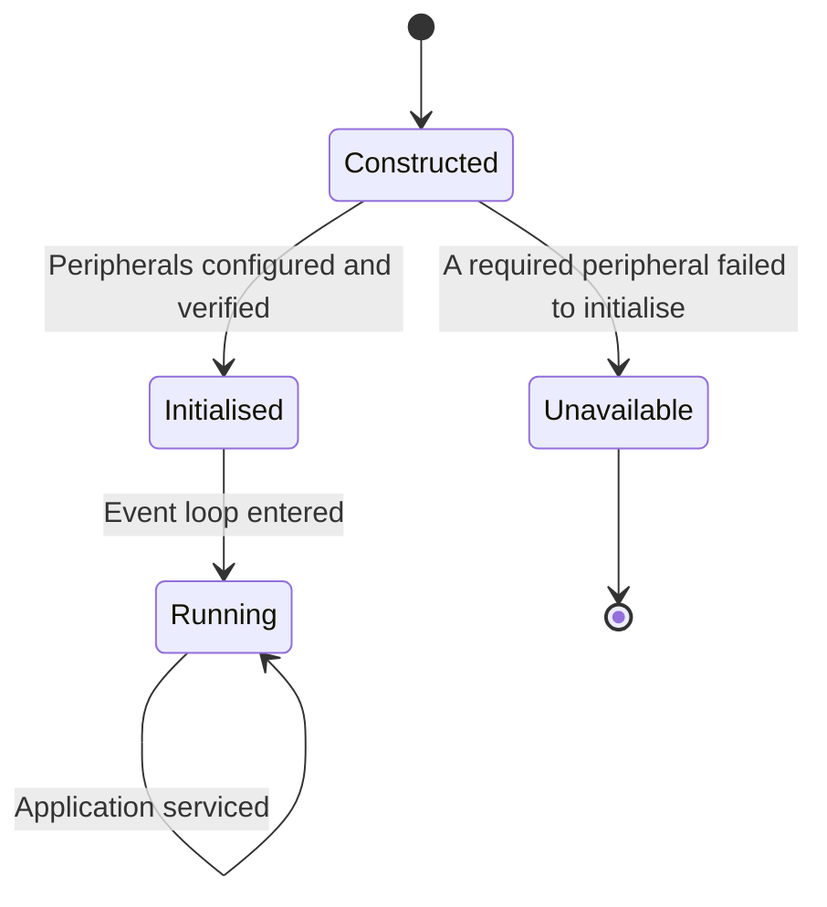
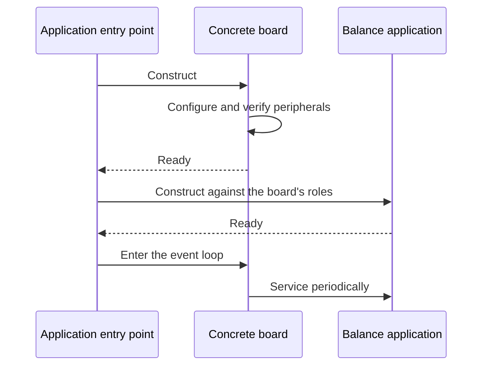
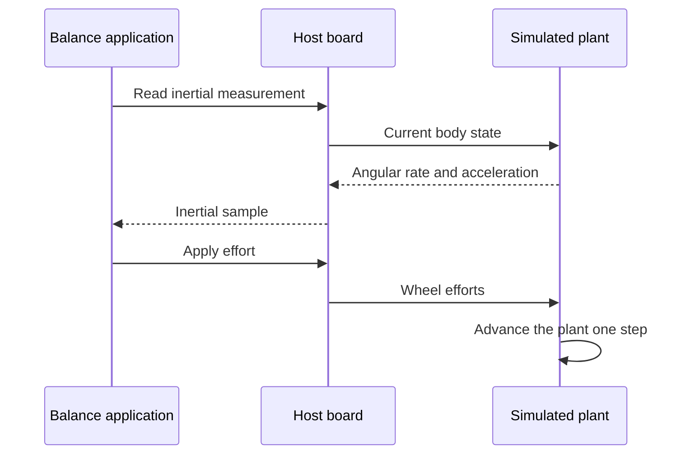
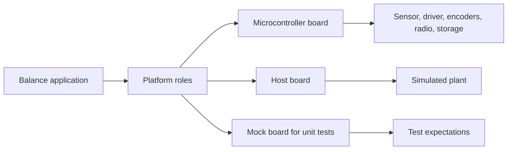

| Field     | Value                       |
|-----------|-----------------------------|
| Title     | Platform Abstraction Design |
| Type      | design                      |
| Status    | draft                       |
| Version   | 0.4.0                       |
| Component | platform-abstraction        |
| Date      | 2026-09-24                  |

> The seam that lets a balancing robot be developed, tested and debugged without a
> balancing robot. Every peripheral the application needs appears here as a role, and
> each board supplies the parts that fill those roles.

---

## Responsibilities

**Is responsible for:**
- Declaring the peripheral roles the application requires, in terms of capability rather
  than of any particular part.
- Fixing the conventions — axis orientation, sign of forward wheel motion, effort
  normalisation — that every board implementation must honour.
- Owning the event loop that the application runs on.
- Making the whole control stack constructible on the host, with no microcontroller present.

**Is NOT responsible for:**
- Any application behaviour. It supplies capability; it never decides anything.
- Choosing which sensor or driver part is fitted.
- Providing a uniform interface for peripherals only one board has.
- Hiding timing. Roles that carry real-time obligations state them.

---

## Component Details

### Part A — Roles, not parts

The abstraction names what the application needs — a source of body-frame inertial
measurements, a pair of wheel encoders, a two-motor bridge controller, a Bluetooth
peripheral, a parameter store, a timebase — without naming how any of them is built. This
is what keeps the inertial part choice an open question that does not block the estimator,
the controller or their tests.

The existing scaffold seam already carries a status indicator, a serial channel and a
tracer for the blink-and-CLI example. Those stay: a status LED and a diagnostic trace
channel remain useful on a robot, and removing them would break the worked example before
the robot's own components exist to replace it.

### Part B — Conventions are part of the contract

An interface that gets the sign of a wheel wrong compiles perfectly and falls over. The
abstraction therefore fixes, as a contract every implementation must meet:

- the body-frame axis convention for inertial measurements, and the sense of positive pitch;
- that forward robot motion produces a positive displacement on *both* wheels, despite
  their mirrored mounting;
- that effort is normalised and signed, with the sign selecting direction;
- that the timebase is monotonic and that measured intervals, not nominal ones, are what
  callers receive.

These are stated once here rather than rediscovered per board. The body frame, which the first
bullet makes binding, is:

| Axis | Direction |
|------|-----------|
| x    | Forward   |
| y    | Left      |
| z    | Up        |

Right-handed, with the accelerometer reporting the gravity vector — so at rest and upright the z
axis reads about -9.81 m/s² — and positive pitch nose-up about y. This follows from the
accelerometer model in `documentation/theory/attitude-estimation.md`, which infers pitch as
`atan2(-a_x, -a_z)`. Mapping a particular part's axes onto these is the board's job, not the
application's.

### Part C — The host implementation

The host board is not a stub that returns zeros. It is the substrate for testing: a
simulated plant can drive the inertial and encoder roles from the efforts the controller
commands, closing the loop entirely in software. That is what makes the specification
scenarios runnable off-target once step definitions exist, and it is why the abstraction
must express the plant-facing roles in terms the host can synthesise.

### Part D — Construction and injection

A board is constructed first; the application is constructed against it and holds
references for its lifetime. Nothing is looked up globally and nothing is discovered at
run time, so the dependency graph is visible at the construction site and every component
can be handed a test double instead.

### Part E — The timer budget is an architectural constraint

The selected part has two general-purpose timers with an encoder mode, one low-power timer with
an encoder mode, and one timer with four independent output channels and a break input. The
motor driver's four bridge inputs want that four-channel timer, so that both motors switch in
phase and a single break input releases every input in hardware. That leaves the second
general-purpose timer and the low-power timer for the wheels.

| Timer  | Use                                                                     |
|--------|-------------------------------------------------------------------------|
| TIM1   | Motor driver bridge inputs, four channels, break input on the fault net |
| TIM2   | Right wheel encoder, x4 quadrature                                      |
| LPTIM1 | Left wheel encoder, x4 quadrature                                       |
| TIM16  | Free                                                                    |
| TIM17  | Free                                                                    |

The low-power timer's counter is 16 bits, which is ample for the configured encoder
resolution, and it has no per-phase polarity; the left wheel is the unmirrored one, so it does
not need any.

The serial buses are just as constrained. This part has two SPIs and no usable I2C — every
I2C1 pin option collides with the console UART, an encoder phase or a motor output. So:

| Bus  | Use                                                                                        |
|------|--------------------------------------------------------------------------------------------|
| SPI1 | Motor driver configuration and read-back, on PB3/PB4/PB5 with an active-high select on PA4 |
| SPI2 | Inertial sensor, with data-ready on PC6                                                    |

The reservation matters: the motor driver's configuration channel is the only other thing on
this board that needs a bus, and spending SPI1 on the sensor would have left it nowhere to go.

| Signal                       | Pins                                 |
|------------------------------|--------------------------------------|
| Bridge inputs A1, A2, B1, B2 | PA8, PA9, PA10, PA11 (TIM1 CH1–CH4)  |
| Driver fault                 | PA6 (TIM1 break) and PC4 (interrupt) |
| Driver sleep, reset          | PB8, PB9                             |
| Left encoder A, B, index     | PC0, PC2 (LPTIM1 IN1, IN2), PC5      |
| Right encoder A, B, index    | PA0, PA1 (TIM2 CH1, CH2), PC3        |

This is a board-level allocation, not part of the abstraction — the roles above say nothing
about timers or buses, and a board with more of them is free to spend them differently. It is
recorded here because it is the constraint that shaped three component designs, and
rediscovering it from the pinout tables is expensive.

### Part F — Failure is expressible

Peripherals fail. Roles that can fail say so in their results rather than returning a
plausible value — an inertial read reports that it failed, a driver configuration read-back
reports a mismatch, a parameter store reports that it is absent. The application is designed
to treat these as first-class outcomes, which is only possible if the abstraction admits
them.

### Part G — The Bluetooth role starts late

The radio is the one role that is not ready when the board is constructed. On the selected part the
Bluetooth stack runs on a second core, which boots and reports back some time after the first core
is running. The role is therefore started, not constructed: the application asks the board to start
the radio under a given device name, and the board hands back the peripheral once the stack is up.
Nothing else waits for it, and a board without a radio simply never hands it back.

The peripheral is the library's own Bluetooth abstractions and nothing board-specific: GAP and a
GATT server for the robot's service. The GATT server reports the attribute MTU the client negotiates,
so the board needs no link observer of its own.

On the selected part the second core runs the vendor's full Bluetooth stack, flashed separately
from the application; the board's notes list the image and address.

### Part H — The watchdog

The selected board runs a window watchdog. A stalled event loop resets the part rather than leaving
the bridges on their last duty cycle, and a reset always resumes with the drive disabled. Flash
operations refresh the watchdog around the short critical section in which the wireless coprocessor
is locked out of flash.

---

## Interfaces

### Provided

| Interface                 | Purpose                                                         | Contract                                                                                                                   |
|---------------------------|-----------------------------------------------------------------|----------------------------------------------------------------------------------------------------------------------------|
| Inertial measurement role | Body-frame angular rate and acceleration                        | Fixed axis convention; failure and staleness reported explicitly, never substituted                                        |
| Wheel encoder role        | Signed counts for both wheels, and the counter resolution       | Lossless across counter wrap; forward motion positive on both wheels; index events are not yet provided — see REQ-ODOM-005 |
| Motor driver role         | The two motor bridges, plus notification when the driver faults | Tri-state reachable without a healthy control loop; a fault is reported, never polled                                      |
| Motor bridge role         | Two duty cycles, one per driver input                           | Both inputs low releases the bridge; the encoding is the driver's, not the board's                                         |
| Bluetooth peripheral role | Advertising, connection, pairing, GATT database                 | Started asynchronously under a device name; exposes GAP and GATT server; connection loss and MTU changes observable        |
| Parameter store role      | Two flash areas holding the tuning store                        | Readable at power-on; writes may be held until the board allows them; an empty or corrupt store falls back to defaults     |
| Timebase role             | Periodic scheduling and interval measurement                    | Monotonic; reports the measured interval                                                                                   |
| Status indicator role     | Visible heartbeat and mode indication                           | Never on a timing-critical path                                                                                            |
| Trace role                | Diagnostic text output                                          | May be a no-op on a board without a channel; never blocks the control loop                                                 |
| Event loop                | Hand control to the platform's scheduler                        | Does not return on the target                                                                                              |

### Required

| Interface         | Purpose                              | Contract                                                              |
|-------------------|--------------------------------------|-----------------------------------------------------------------------|
| Board peripherals | Whatever the concrete board provides | Supplied by each board implementation; not visible to the application |

---

## Data Model

| Entity          | Field        | Type / Unit                           | Range             | Notes                                                              |
|-----------------|--------------|---------------------------------------|-------------------|--------------------------------------------------------------------|
| Inertial sample | angularRate  | radians per second, three axes        | part-dependent    | Body frame, fixed convention                                       |
| Inertial sample | acceleration | metres per second squared, three axes | part-dependent    | Body frame, fixed convention                                       |
| Inertial sample | valid        | boolean                               | true or false     | False on transfer failure                                          |
| Encoder sample  | counts       | signed counts per wheel               | full signed range | Accumulated across wrap                                            |
| Encoder sample  | indexSeen    | boolean per wheel                     | true or false     | Advisory; never resets counts. Not yet provided — see REQ-ODOM-005 |
| Effort command  | value        | normalised effort                     | -1.0 to 1.0       | Sign selects direction                                             |
| Timebase        | interval     | microseconds                          | monotonic         | Measured, not nominal                                              |

---

## State Machine

Board lifecycle, identical on every platform.

---

## Sequence Diagrams

Composition at startup — the only place the concrete board is visible.

The same application against a simulated plant on the host.

---

## Block Diagram

---

## Constraints & Limitations

| Constraint              | Value / Description                                                                                                              |
|-------------------------|----------------------------------------------------------------------------------------------------------------------------------|
| No allocation           | Roles are constructed once at startup; no allocation after that                                                                  |
| No global state         | Dependencies are injected at construction; nothing is looked up globally                                                         |
| Conventions are binding | Axis orientation, wheel sign and effort normalisation are part of the contract, not per-board choices                            |
| Capability, not parts   | A role exists only if more than one board could plausibly provide it                                                             |
| Timing is explicit      | Roles with real-time obligations state them; the abstraction does not hide latency                                               |
| Host fidelity           | The host board can reproduce interfaces and timing, but not analogue reality. Passing on the host is necessary, never sufficient |
| Scaffold roles retained | The status indicator, serial channel and tracer remain until the robot's own components replace the worked example               |

---

## Open Questions

| # | Question                                                                                 | Options                                                               | Status                                                                                                                                                                                                                                                                   |
|---|------------------------------------------------------------------------------------------|-----------------------------------------------------------------------|--------------------------------------------------------------------------------------------------------------------------------------------------------------------------------------------------------------------------------------------------------------------------|
| 1 | Does the inertial role expose raw samples or a configured sample rate the board owns?    | Application-driven polling; board-driven sample callback              | decided — a board-driven callback. The part asserts data-ready at its own cadence, so the board owns the rate and timestamps each sample as the driver delivers it, one bus transfer after the edge; polling would report the poller's interval rather than the sensor's |
| 2 | Should the simulated plant live behind the host board or beside it as a separate tool?   | Behind the host board; separate simulator composed at the entry point | open                                                                                                                                                                                                                                                                     |
| 3 | Is the parameter store a distinct role or part of the board's general configuration?     | Distinct role; folded into board configuration                        | decided — a distinct role: the board provides two flash areas for the application's tuning store, while the Bluetooth bonds stay a board concern with their own store                                                                                                    |
| 4 | Should a second board be defined now to prove the abstraction is not shaped by one part? | Defer until the first board works; define early as a design check     | open                                                                                                                                                                                                                                                                     |
