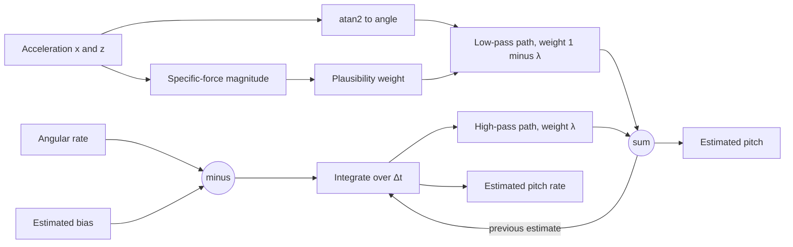

| Field     | Value                                       |
|-----------|---------------------------------------------|
| Title     | Pitch Estimation from Inertial Measurements |
| Type      | theory                                      |
| Status    | draft                                       |
| Version   | 0.1.0                                       |
| Component | attitude-estimation                         |
| Date      | 2026-09-16                                  |

> Why neither inertial sensor can measure pitch on its own, and how combining them produces
> an estimate good enough to balance on.

---

## Overview

The controller needs body pitch, and nothing on the robot measures it. The gyroscope
measures *rate*, which integrates into an angle that drifts without bound. The
accelerometer measures *specific force*, which points along gravity only when the robot is
not accelerating — and a balancing robot accelerates constantly, by design.

Worse, the coupling is adversarial. To accelerate forwards the robot leans forwards; the
lean is real tilt, the acceleration is fake tilt, and they have the same sign. An
accelerometer-only estimate would see roughly double the true lean and command a correction
that makes it worse.

Fusion resolves this in the frequency domain: trust the gyroscope at high frequency where
drift has not accumulated, and the accelerometer at low frequency where body acceleration
averages out. The main result is the complementary filter

$$
\hat{\theta}_k = \lambda\left(\hat{\theta}_{k-1} + \left(\omega_k - \hat{b}\right)\Delta t\right) + (1 - \lambda)\,\theta_{a,k},
\qquad
\lambda = \frac{\tau_c}{\tau_c + \Delta t}
$$

with a single tuning constant $\tau_c$ setting the crossover. The Kalman filter that solves
the same problem optimally is derived alongside it, since both satisfy the requirements and
the choice between them remains open.

---

## Prerequisites

Rigid-body kinematics, first-order low-pass and high-pass filtering, random-walk noise
processes, and the discrete Kalman filter.

| Symbol         | Meaning                                             | Unit  |
|----------------|-----------------------------------------------------|-------|
| $\theta$       | True body pitch from vertical                       | rad   |
| $\hat{\theta}$ | Estimated body pitch                                | rad   |
| $\theta_a$     | Pitch inferred from the accelerometer alone         | rad   |
| $\omega$       | Measured angular rate about the pitch axis          | rad/s |
| $b$            | Gyroscope bias                                      | rad/s |
| $\hat{b}$      | Estimated gyroscope bias                            | rad/s |
| $n_\omega$     | Gyroscope white noise                               | rad/s |
| $n_a$          | Accelerometer noise, including vibration            | m/s²  |
| $a_x,\ a_z$    | Measured specific force along the body x and z axes | m/s²  |
| $\Delta t$     | Sampling interval                                   | s     |
| $\tau_c$       | Complementary filter crossover time constant        | s     |
| $\lambda$      | Complementary filter coefficient                    | —     |
| $\mathbf{x}$   | Kalman state $[\theta,\ b]^{\top}$                  | mixed |
| $P$            | Kalman state covariance                             | —     |
| $Q,\ R$        | Process and measurement noise covariances           | —     |
| $K$            | Kalman gain                                         | —     |

---

## Mathematical Foundation

### Model / Setup

**Gyroscope.** The measurement is the true rate plus a slowly varying bias and white noise:

$$
\omega_{\text{meas}} = \dot{\theta} + b + n_\omega
$$

The bias is the problem. Integrating to obtain an angle,

$$
\hat{\theta}(t) = \int_0^{t}\omega_{\text{meas}}\,dt' = \theta(t) + \underbrace{bt}_{\text{ramp}} + \underbrace{\int n_\omega\,dt'}_{\text{random walk}}
$$

The bias contributes an error growing *linearly* in time, and the white noise a random walk
growing as $\sqrt{t}$. For a typical consumer gyroscope with an uncalibrated bias of
0.02 rad/s, the ramp reaches 1.1° after one second and 34° after thirty. Integration alone is
unusable within seconds.

**Accelerometer.** The device measures specific force — gravity minus the body's own
acceleration. Resolved in the body frame,

$$
\begin{bmatrix} a_x \\ a_z \end{bmatrix}
= \begin{bmatrix} -g\sin\theta \\ -g\cos\theta \end{bmatrix} - \begin{bmatrix} a_{\text{body},x} \\ a_{\text{body},z} \end{bmatrix} + n_a
$$

so the inferred angle is

$$
\theta_a = \operatorname{atan2}(-a_x,\ -a_z)
$$

With $a_{\text{body}} = 0$ this is exact and drift-free. With $a_{\text{body}} \neq 0$ it is
wrong — and for small angles the error is approximately $a_{\text{body},x}/g$, meaning a
modest 1 m/s² acceleration produces a 5.8° false tilt.

### Derivation

**Step 1 — The complementary decomposition.** The two errors are complementary in frequency:
gyroscope error is concentrated at low frequency (a ramp), accelerometer error at high
frequency (vibration and transient acceleration). So high-pass the gyroscope path and
low-pass the accelerometer path with the *same* cutoff, so the two transfer functions sum to
unity:

$$
\hat{\Theta}(s) = \underbrace{\frac{\tau_c s}{\tau_c s + 1}}_{\text{gyro, high-pass}}\Theta_g(s)
               + \underbrace{\frac{1}{\tau_c s + 1}}_{\text{accel, low-pass}}\Theta_a(s)
$$

Because $\frac{\tau_c s}{\tau_c s+1} + \frac{1}{\tau_c s+1} = 1$ identically, the filter has
**unity gain at every frequency** — it neither attenuates nor amplifies true motion. That
identity is the reason for the name, and the reason the filter introduces no lag on a true
tilt.

**Step 2 — Discrete form.** Applying a backward-difference discretisation and noting that the
gyroscope path is the previous estimate advanced by the measured rate:

$$
\boxed{\ \hat{\theta}_k = \lambda\left(\hat{\theta}_{k-1} + (\omega_k - \hat{b})\Delta t\right) + (1-\lambda)\,\theta_{a,k}\ }
\qquad
\lambda = \frac{\tau_c}{\tau_c + \Delta t}
$$

At 500 Hz with $\tau_c = 0.5$ s, $\lambda = 0.5/(0.5+0.002) = 0.996$ — the estimate is
dominated by integration, with the accelerometer applying a gentle 0.4% correction each
sample that prevents unbounded drift.

**Step 3 — Choosing the crossover.** $\tau_c$ trades the two error sources directly. Gyro
drift over the crossover interval is about $b\tau_c$; accelerometer error passed through is
about $a_{\text{body}}/g$ attenuated by the low-pass. Equating them,

$$
\tau_c \approx \frac{\sigma_a}{g\,\sigma_b}
$$

where $\sigma_a$ characterises typical body acceleration and $\sigma_b$ the residual bias
after calibration. Larger $\tau_c$ rejects acceleration better but drifts more; smaller
$\tau_c$ holds the long-term reference tighter but lets the robot's own motion in. Values
between 0.2 s and 2 s are practical, and the residual bias is precisely what calibration
exists to shrink.

**Step 4 — Bias calibration.** Averaging $N$ samples while stationary, the mean measurement
is

$$
\hat{b} = \frac{1}{N}\sum_{k=1}^{N}\omega_k = b + \frac{1}{N}\sum_{k=1}^{N} n_{\omega,k}
$$

The residual error has standard deviation $\sigma_\omega/\sqrt{N}$ — averaging longer helps,
but only as $\sqrt{N}$. At 500 Hz a one-second window gives $N = 500$ and shrinks the noise
contribution by more than twenty times.

The hazard is that this estimator cannot distinguish bias from genuine rotation. If the robot
moves during the window, real motion is absorbed into $\hat{b}$ and then subtracted from every
future sample — a permanent, silent error. Hence the stillness check: verify that the sample
spread is consistent with noise alone before accepting the result.

**Step 5 — Rejecting body acceleration.** Body acceleration is detectable when it changes the
*magnitude* of the specific force away from $g$:

$$
w_k = f\!\left(\left|\,\|\mathbf{a}_k\| - g\,\right|\right), \qquad f \text{ decreasing}
$$

Weighting the accelerometer correction by $w_k$ effectively lengthens $\tau_c$ during
accelerating intervals, leaning on the gyroscope exactly when the accelerometer is least
trustworthy. The limitation is geometric: a purely horizontal acceleration at small tilt
barely changes the magnitude, so this detects vigorous manoeuvres well and gentle
accelerations poorly.

**Step 6 — The Kalman formulation.** Treating bias as a state rather than a calibrated
constant gives $\mathbf{x} = [\theta,\ b]^{\top}$ with

$$
\mathbf{x}_k = \begin{bmatrix} 1 & -\Delta t \\ 0 & 1 \end{bmatrix}\mathbf{x}_{k-1}
             + \begin{bmatrix} \Delta t \\ 0 \end{bmatrix}\omega_k + \mathbf{w}_k,
\qquad
\theta_{a,k} = \begin{bmatrix} 1 & 0 \end{bmatrix}\mathbf{x}_k + v_k
$$

with the standard predict and update recursion

$$
P_k^{-} = FP_{k-1}F^{\top} + Q, \qquad
K_k = \frac{P_k^{-}H^{\top}}{HP_k^{-}H^{\top} + R}, \qquad
\hat{\mathbf{x}}_k = \hat{\mathbf{x}}_k^{-} + K_k\left(\theta_{a,k} - H\hat{\mathbf{x}}_k^{-}\right)
$$

The essential difference is that $K_k$ is computed from the covariance rather than fixed. It
is large while uncertainty is high — giving fast initial convergence — and shrinks as the
estimate settles. **In steady state the Kalman gain converges to a constant, at which point
the filter is algebraically a complementary filter with an optimally chosen $\lambda$.** The
two approaches are not rivals so much as the same filter with the crossover either tuned by
hand or derived from noise statistics.

The Kalman filter's genuine advantage is tracking bias *online*, which removes the
assumption that the bias measured at power-on holds for the whole session.

### Key Results

$$
\begin{aligned}
\theta_a &= \operatorname{atan2}(-a_x,\ -a_z) && \text{(drift-free, corrupted by body acceleration)}\\[2mm]
\hat{\theta}_k &= \lambda\left(\hat{\theta}_{k-1} + (\omega_k - \hat{b})\Delta t\right) + (1-\lambda)\theta_{a,k},
  \quad \lambda = \frac{\tau_c}{\tau_c + \Delta t} && \text{(complementary)}\\[2mm]
\hat{b} &= \frac{1}{N}\sum_{k=1}^{N}\omega_k, \qquad \sigma_{\hat{b}} = \frac{\sigma_\omega}{\sqrt{N}} && \text{(calibration)}\\[2mm]
\varepsilon_{\text{accel}} &\approx \frac{a_{\text{body},x}}{g} && \text{(false tilt, small angles)}
\end{aligned}
$$

---

## Block Diagrams



The frequency split, drawn as magnitude against frequency:

```text
  gain
   1 ─┤──────────╲              ╱──────────
      │  accel    ╲            ╱   gyro
      │  (LP)      ╲          ╱    (HP)
      │             ╲        ╱
   0 ─┤──────────────╳──────────────────────► log ω
                  ω = 1/τ_c
     sum of the two paths = 1 at every frequency
```

---

## Numerical Properties

| Property    | Value / Condition                                                                                                                                                                                                                                             |
|-------------|---------------------------------------------------------------------------------------------------------------------------------------------------------------------------------------------------------------------------------------------------------------|
| Complexity  | Complementary: one `atan2`, a handful of multiply-accumulates — a few hundred cycles on a Cortex-M4 with hardware floating point. Kalman: a 2×2 predict/update, roughly 50 operations plus one division; both fit a 500 Hz budget comfortably                 |
| Precision   | Single precision suffices for the angle. The integrated angle accumulates $\Delta t$ rounding over thousands of samples, but the accelerometer correction continuously re-anchors it, so error does not compound                                              |
| Stability   | Complementary: unconditionally stable for $0 < \lambda < 1$; the single pole at $1/\tau_c$ is always in the left half plane. Kalman: stable provided $Q \succeq 0$ and $R > 0$, though $P$ can lose positive-definiteness through rounding if updated naively |
| Range       | `atan2` covers the full circle, but the estimate is only *useful* within the controller's valid envelope, roughly ±15°                                                                                                                                        |
| Convergence | From an accelerometer-initialised start, within 1° in under 1 s — satisfying `REQ-EST-004`                                                                                                                                                                    |

**Sensitivities.** The dominant one is **residual gyroscope bias**, which maps directly to
steady-state error of roughly $\hat{b}\tau_c$. With $\tau_c = 0.5$ s, holding the 1°-per-60 s
drift budget of `REQ-EST-003` requires the residual bias after calibration to stay below
about 0.02 rad/s — achievable with a one-second averaging window, which is exactly why the
calibration window is specified as it is.

Second is **$\tau_c$ itself**, the single knob trading drift against acceleration
sensitivity, and the only parameter that genuinely needs tuning on the real robot.

Third is **sampling interval jitter**. $\Delta t$ appears directly in the integration, so
timing jitter injects angle error in proportion. Using the *measured* interval rather than
the nominal one removes most of this, which is why the timebase contract specifies measured
intervals.

Least sensitive is accelerometer noise, which the low-pass path attenuates heavily —
structural vibration matters far more than the sensor's own noise floor, since vibration is
broadband and can alias into the passband.

---

## Worked Example

A one-second forward acceleration of 1.5 m/s² while the robot leans 8° forward, at 500 Hz
with $\tau_c = 0.5$ s ($\lambda = 0.996$).

The accelerometer alone reports a false tilt of approximately

$$
\varepsilon = \frac{1.5}{9.81} \approx 0.153\ \text{rad} \approx 8.8^{\circ}
$$

on top of the true 8°, so $\theta_a \approx 16.8^{\circ}$ — more than double the truth, and
an unusable input to a controller whose fall threshold is 35°.

The complementary filter admits this error only through the low-pass path. Over $N = 500$
samples the accumulated contamination is bounded by

$$
\varepsilon_{\text{filtered}} \approx \varepsilon\left(1 - \lambda^{N}\right)
= 8.8^{\circ}\left(1 - 0.996^{500}\right) \approx 8.8^{\circ} \times 0.865 \approx 7.6^{\circ}
$$

Still too much — a sustained acceleration eventually leaks fully through, which is exactly
the limitation noted below. Plausibility weighting is what closes the gap: the specific-force
magnitude during this manoeuvre is

$$
\|\mathbf{a}\| = \sqrt{9.81^{2} + 1.5^{2}} \approx 9.93\ \text{m/s}^{2}
$$

a 1.2% departure from $g$ that is readily detectable. Attenuating the correction by, say, a
factor of ten during the manoeuvre effectively raises $\tau_c$ to 5 s, reducing the leaked
error to roughly

$$
8.8^{\circ}\left(1 - 0.9996^{500}\right) \approx 8.8^{\circ} \times 0.181 \approx 1.6^{\circ}
$$

comfortably within the 2° transient budget of the corresponding scenario. Meanwhile the
gyroscope carries the true dynamics throughout, and after the manoeuvre the accelerometer
path re-anchors the estimate within a few time constants.

---

## Limitations & Assumptions

- **Assumes**: gyroscope bias is constant over a session, so a single calibration holds.
  Temperature drift violates this; the Kalman formulation tracks it, the complementary one
  does not.
- **Assumes**: the robot is genuinely still during calibration. Motion is absorbed into the
  bias and becomes a permanent error, which is why stillness is verified rather than trusted.
- **Assumes**: body acceleration is zero-mean over the crossover interval.
- **Assumes**: the pitch axis is well aligned with a sensor axis; misalignment appears as a
  fixed scale error.
- **Does not handle**: sustained acceleration. As the worked example shows, a long steady
  acceleration is geometrically indistinguishable from a tilt. Bounding the duration of
  commanded acceleration is a system-level answer, not a filter one.
- **Does not handle**: free fall, where $\|\mathbf{a}\| \to 0$ and the gravity reference
  disappears entirely.
- **Does not handle**: roll or yaw attitude. Only pitch is estimated; yaw *rate* comes from
  wheel odometry, and yaw angle is never estimated because nothing needs it.
- **Does not handle**: magnetic heading. No magnetometer is used, so yaw has no absolute
  reference and would drift if integrated.
- **Does not handle**: vibration aliasing. Structural resonance above the Nyquist frequency
  folds into the passband and is indistinguishable from real tilt.

---

## References

1. Higgins, W. T. "A Comparison of Complementary and Kalman Filtering." *IEEE Transactions on
   Aerospace and Electronic Systems*, AES-11(3), 1975 — the equivalence used in Step 6.
2. Colton, S. "The Balance Filter: A Simple Solution for Integrating Accelerometer and
   Gyroscope Measurements for a Balancing Platform." MIT, 2007.
3. Mahony, R., Hamel, T. and Pflimlin, J.-M. "Nonlinear Complementary Filters on the Special
   Orthogonal Group." *IEEE Transactions on Automatic Control*, 53(5), 2008.
4. Brown, R. G. and Hwang, P. Y. C. *Introduction to Random Signals and Applied Kalman
   Filtering*, 4th ed.
5. Woodman, O. J. "An Introduction to Inertial Navigation." Technical Report UCAM-CL-TR-696,
   University of Cambridge, 2007 — inertial error models and drift characterisation.
